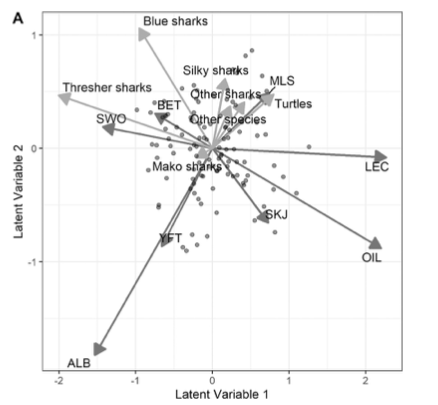
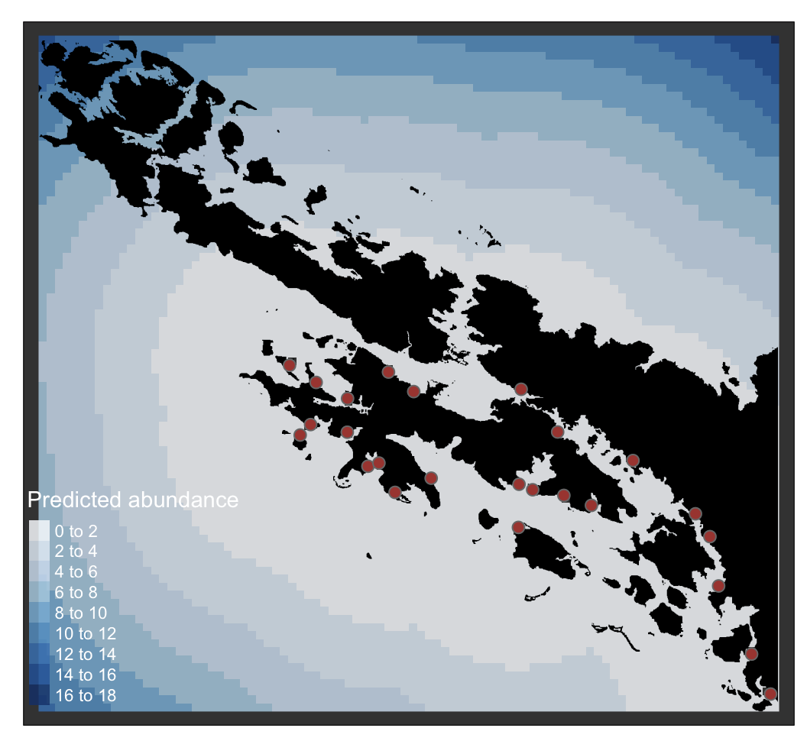

([ENLACE RÁPIDO PARA OBTENER LOS DATOS](https://github.com/cbrown5/predictive-ecological-models/raw/main/data-cleaned.zip))


```{r setup, include=FALSE}
knitr::opts_chunk$set(echo = TRUE, message = FALSE, warning = FALSE)
```

¿Quién soy?

[Chris es Profesor](https://discover.utas.edu.au/C.J.Brown) en el Instituto de Estudios Marinos y Antárticos de la Universidad de Tasmania. Chris y su equipo en el laboratorio [Seascapemodels](https://www.seascapemodels.org/) trabajan en la conservación de ecosistemas oceánicos y la gestión sostenible de pesquerías. Su equipo utiliza avances en enfoques de modelado estadístico para sintetizar datos ecológicos e informar la toma de decisiones ambientales.

La carrera de Chris se construyó con las herramientas de código abierto de R. Él devuelve ese favor [creando recursos gratuitos de R](https://www.seascapemodels.org/code.html) y enseñando talleres en todas partes.

# Introducción

R es el lenguaje de programación líder para el modelado ecológico por buenas razones. Ser gratuito y de código abierto ciertamente ayuda. Tener fortalezas en visualización de datos también ayuda. Y debido a estas características, R ahora tiene un enorme ecosistema de paquetes contribuidos por usuarios que permiten aplicaciones de modelado sofisticadas.

Este ecosistema de paquetes de R es creado por una enorme comunidad de usuarios de R, muchos de los cuales son líderes en su campo desarrollando modelos estadísticos de vanguardia y herramientas de ciencia de datos. Esto significa que si conoces R, puedes acceder a herramientas de vanguardia y combinarlas de nuevas maneras.

Aunque hay otros lenguajes que sobresalen en computación científica, R domina el mercado en modelado estadístico ecológico, el tema de este curso.

Hasta hace poco, la mayoría de los usuarios de R preparaban sus datos fuera de R (por ejemplo, en Excel o Arc GIS) y luego los leían en R para el modelado. Pero R ahora también tiene paquetes de SIG y mapeo eficientes y fáciles de usar. Esto significa que puedes crear todo tu flujo de trabajo de análisis, desde la descarga de datos hasta la visualización, en R.

Pero comenzar un proyecto en R puede ser desalentador para nuevos usuarios. Hay una curva de aprendizaje pronunciada para la codificación, y hay tantas opciones de paquetes que es fácil tener parálisis de decisión.

Así que en este curso vamos a proporcionar una introducción a algunos enfoques comunes de modelado en R. También aprenderemos cómo construir un flujo de trabajo eficiente. Nuestros objetivos hoy son:

1. Revisar la capacidad de R para análisis de datos, gráficos y mapeo

2. Aprender a construir flujos de trabajo eficientes y repetibles para modelado predictivo

3. Aprender a ejecutar algunos modelos

4. Aprender a visualizar datos espaciales y resultados de modelos

Este curso es adecuado para personas que tienen alguna experiencia con R. No es un curso para principiantes, pero los usuarios con un poco de experiencia en R pueden seguir las primeras secciones.

## Métodos que cubriremos

En este curso revisaremos:

- Mapeo en R con archivos de forma y rásteres (usando los paquetes modernos `sf` y `terra`)

- Modelos lineales generalizados

- Modelos aditivos generalizados

## Lo que necesitarás

Asegúrate de tener una versión reciente de R (disponible en el sitio web de CRAN) y Rstudio instalado (la versión gratuita de escritorio está bien).

Necesitarás instalar estos paquetes:

```{r, eval=FALSE}
install.packages(c("tmap", "tidyverse",
                   "sf", "corrplot",
                   "patchwork", "visreg"))

```

[También necesitarás descargar los datos para el curso](https://github.com/cbrown5/predictive-ecological-models/raw/main/data-cleaned.zip).

## Caso de estudio: Pez loro de cabeza de joroba, 'Topa' en las Islas Salomón

Los peces loro de cabeza de joroba (*Bolbometopon muricatum*) son una especie enigmática de peces tropicales. Los adultos de esta especie se caracterizan por una gran protuberancia en su frente que los machos usan para exhibirse y luchar durante la reproducción. La determinación del sexo para esta especie es desconocida, pero es probable que un individuo tenga el potencial de desarrollarse como macho o hembra al alcanzar la madurez.

Los adultos viajan en escuelas y consumen algas mordiendo trozos de coral y en el proceso literalmente defecan arena limpia. Debido a su gran tamaño, hábito de formar cardúmenes y madurez tardía, son susceptibles a la sobrepesca, y [muchas poblaciones están en declive](https://doi.org/10.1007/s00338-019-01801-z).

Su ciclo de vida se caracteriza por la migración desde arrecifes lagunares como juveniles (ver imagen a continuación) hasta hábitats de plataforma de arrecife y arrecifes expuestos como adultos. Los juveniles en etapas tempranas son carnívoros y se alimentan de zooplancton, y luego se transforman en herbívoros a una edad temprana.


Imagen: Ciclo de vida del pez loro de cabeza de joroba. Imagen de E. Stump y obtenida de [Hamilton et al. 2017](http://dx.doi.org/10.1016/j.biocon.2017.04.024).

Hasta mediados de la década de 2010, el hábitat para las postlarvas y juveniles en asentamiento era un misterio. Sin embargo, el patrón de migración desde la costa hacia mar adentro a lo largo de su ciclo de vida conocido sugiere que las primeras etapas bentónicas ('reclutas') podrían ocurrir en hábitats de arrecifes cercanos a la costa.

Los hábitats de arrecifes cercanos a la costa son susceptibles a la degradación por mala calidad del agua, lo que genera preocupaciones de que esta especie también pueda estar en declive debido a la contaminación. Pero la falta de datos de las primeras etapas de vida dificulta una mayor exploración de este problema.

En este curso analizaremos la primera encuesta que reveló las preferencias de hábitat de las primeras etapas juveniles del pez loro de cabeza de joroba. Estos datos fueron analizados por [Hamilton et al. 2017](http://dx.doi.org/10.1016/j.biocon.2017.04.024) y [Brown and Hamilton 2018](http://dx.doi.org/10.1111/cobi.13079).

En la década de 2010, Rick Hamilton (The Nature Conservancy) dirigió una serie de encuestas en los hábitats de arrecifes cercanos a la costa de la provincia de Kia, Islas Salomón. El objetivo era buscar el hábitat de reclutamiento para los peces loro juveniles de cabeza de joroba. Estas encuestas fueron motivadas por la preocupación de las comunidades locales en Kia de que los topa (el nombre local para los peces loro de cabeza de joroba) están en declive.

En las encuestas, los buzos nadaron transectos estandarizados y buscaron peces loro juveniles de cabeza de joroba en hábitats cercanos a la costa, a menudo a lo largo del borde de los manglares. En total, encuestaron 49 sitios en toda Kia.

Estas encuestas fueron aún más desafiantes debido a la presencia de cocodrilos en el hábitat de manglares de la región. Por lo tanto, estos datos son increíblemente valiosos.

La tala en la región de Kia ha causado [problemas de calidad del agua que pueden afectar los hábitats coralinos cercanos a la costa](http://dx.doi.org/10.1111/cobi.13079). Durante la tala, los troncos se transportan desde la tierra a las barcazas en 'estanques de troncos'. Un estanque de troncos es un área de manglares que se arrasa con bulldozers para permitir la transferencia de troncos a las barcazas. Como puedes imaginar, los estanques de troncos son muy fangosos. Este daño crea una escorrentía significativa de sedimentos que puede asfixiar y matar los hábitats coralinos.

Rick y el equipo encuestaron arrecifes cerca de estanques de troncos y en áreas que no tenían tala. Solo encontraron reclutas de peces loro de cabeza de joroba escondiéndose en especies de coral ramificado.

En este curso, primero preguntaremos si la presencia de reclutas de peces loro de cabeza de joroba está relacionada con la cobertura de especies de coral ramificado. Luego desarrollaremos un modelo estadístico para analizar la relación entre la contaminación de los estanques de troncos y los reclutas de peces loro de cabeza de joroba, y usaremos este modelo para predecir los impactos de la contaminación en los peces loro de cabeza de joroba en toda la región de Kia.

Los datos y el código para los análisis originales están [disponibles en mi sitio de github](https://github.com/cbrown5/BenthicLatent). En este curso utilizaremos versiones simplificadas de los datos originales. Agradecemos a Rick Hamilton por proporcionar los datos para este curso.

## Planning our project 

An important part of R coding is having an organized workflow. Being organized is important in anything more complex than a one-step R program. Organizing your workflow requires forward planning and sticking to some strategies. In this course we'll follow a simple workflow. 

There are multiple benefits of an organized workflow. You code will be more transparent and repeatable, this will benefit both future you and other researchers. It also means you are less likely to make mistakes and the code is easier to debug when you do. Finally, you may want to share the code publicly so other people can repeat your work. 

First, you'll want to identify your research question. If your question is clear then you can stick to what you need to do, and not end up going down rabbit holes creating code you won't use. Once you have that question I recommmend considering fives steps in your workflow: 

### 1. Gather the data 

You will need to source data, often from online data repositories. Even if you have collected species observations yourself, you will likely need to get environmental covariates for prediction from sources such as weather bureaus, oceanographic repositories or climate models. 

### 2. Data wrangling 

The data needs to be read into R and 'wrangled' into the appropriate data structure for the modelling packages you will use. Just a warning, some packages require different data structures, so make sure you know what you want! For a spatial model this step can involve a lot of (complex) GIS. Thankfully, R has good packages for GIS. 

### 3. Dataviz 

Before starting I always use R's powerful data visualisation tools to explore the data. This gives you a deeper understanding of what you'll model, can help avoid conceptual flaws. Also, you may want to save some data plots for your publication. In this course we'll use R markdown to make a report on our data that can be easily shared with collaborators. 

### 4. Modelling  

Finally, we get to the modelling. This is where we'll spend most time in this course 


### 5. Modelviz  

A powerful way to communicate your models is by making more dataviz. In this course we'll use dataviz look at what the models say are important environmental drivers of fish abundance. 

One final note, the above can be an iterative process. But organize your R scripts like the above and it will be much easier. 

## Lets get started 

So that's all the background, let's get started. We'll work through each step of the above workflow. 

# Setting up your project folder 

Start up Rstudio. I recommend setting up each project as an Rstudio project. Click File>New Project and follow the prompts to create a New project directory. Then drop the data folder into this directory (and make sure you unzip it). 

Also create subdirectories for 'images' and 'scripts', this is where we'll save images and R scripts respectively. 

For complex projects you'll want to create other subfolders to keep organized. e.g. I often have a folder for documents and a folder for model outputs. 

Now whenever you want to work on this project double click the .Rproj file. It will open Rstudio in this working directory (so you never need use `setwd` again!). 

With the project open create a new R script (File>New File>R Script) and save it in the scripts folder. We'll now write our R code in this script.

Just double check your are in the top level working directory by typing `getwd()` into the console. If you opened the .RProj file you will be already there. If you are not, navigate there (e.g. with Session>Set Working Directory). 

## Example directory structure for the project

Keeping organized is critical for any complex R project. Here's one example of how I organise my files. 

```
project/
├── data/
│   ├── raw/                # Raw data files
├── data-cleaned/            # Cleaned data files
├── scripts/
│   ├── 1_data_wrangling.R  # Script for data wrangling
│   ├── 2_dataviz.R         # Script for data visualization
│   ├── 3_modelling.R       # Script for modeling
│   └── helpers.R           # Helper functions
├── outputs/
│   ├── figures/            # Generated figures and plots
│   ├── models/             # Saved model objects
│   └── tables/             # Generated tables
├── images/                 # Images used in the project
├── docs/                   # Documentation or reports
│   └── report.Rmd          # R Markdown report
├── README.md               # Project description and instructions
└── project.Rproj           # RStudio project file
```

# 1. Recopilar los datos

## ¿De dónde obtengo datos para modelos?

Ya deberías tener los datos para este curso, si no [descárgalos de github](https://github.com/cbrown5/predictive-ecological-models/raw/main/data-cleaned.zip).

Los datos para modelos pueden provenir de muchas fuentes. La variable de respuesta es típicamente especies, presencia, abundancia o biomasa. Estos datos pueden provenir de tus propias encuestas, las de colaboradores, repositorios en línea, agencias gubernamentales o ONGs. Ejemplos de fuentes de datos incluyen encuestas pesqueras y programas de ciencia ciudadana.

También querrás algunas covariables, que usaremos para predecir las especies. Estas pueden estar incluidas con los datos, pero a menudo se obtienen de otras fuentes. Por ejemplo, la ['Red Australiana de Datos Oceánicos'](https://portal.aodn.org.au/) tiene una gran cantidad de diferentes fuentes de datos oceánicos disponibles para investigadores de forma gratuita. En mi estado, el gobierno de Queensland también tiene repositorios de conjuntos de datos geográficos que se pueden descargar. Otros estados y países tienen servicios similares.

Hay paquetes especializados de R para acceder a datos ambientales, como [rnaturalearth](https://cran.r-project.org/web/packages/rnaturalearth/vignettes/rnaturalearth.html). El [rLandsat](https://github.com/atlanhq/rLandsat) puede descargar directamente datos de Landsat del USGS y ayudarte a procesarlos.

Otras fuentes de datos comunes incluyen [UNEP](https://data.unep-wcmc.org/) y [Zonas Económicas Exclusivas](https://www.marineregions.org/downloads.php).

Si sabes qué datos quieres, intenta buscar en la web 'r landsat' o 'r packages landsat' para ver si hay un paquete disponible para facilitar la tarea de obtener los datos en un formato compatible con R.

Si no, intenta buscar el tipo de datos y 'descargar' o 'shapefile' (para datos espaciales).

Otra estrategia es mirar artículos revisados por pares que realicen análisis similares y ver qué fuentes de datos citan.

Para este curso ya te he proporcionado los datos, así que comencemos a leerlos en R.

## Cargar los datos

```{r}
library(tidyverse)
dat <- read_csv("data-cleaned/fish-coral-cover-sites.csv")

```

```{r, eval=FALSE}
dat
summary(dat)
```

## Explorando datos

Prefiero el paquete `ggplot2` para graficar. Es fácil cambiar cómo se ven los gráficos con este paquete.

```{r}
ggplot(dat) +
  aes(x = secchi, y = pres.topa) +
  geom_point() +
  stat_smooth()
```

Esto hace un gráfico de dispersión x-y. El ggplot(dat) declara el dataframe del cual extraeremos variables y también crea la página para el gráfico. El aes significa estética para el gráfico, aquí lo usamos para declarar un eje x que es la variable Abundancia de topa (`pres.topa`). Luego geom_points declara un objeto de geometría que decide cómo se trazan las estéticas en la página.

También hemos añadido una línea de tendencia con `stat_smooth()`.

Hagamos también un diagrama de caja:

```{r}
ggplot(dat) +
  aes(x = logged, y = pres.topa) +
  geom_boxplot()
```

Vemos que los topa son más abundantes en sitios no talados.

```{r}
ggplot(dat) +
  aes(x = secchi, y = CB_cover) +
  geom_point() +
  stat_smooth()
```

```{r}
dat <- dat |>
  mutate(CB_cover_percent = 100*CB_cover/n_pts)
```
Este código está creando una nueva columna `CB_cover_percent` en el dataframe `dat`. El operador pipe `%>%` se usa para pasar el dataframe `dat` a la función `mutate`, que añade una nueva columna al dataframe. La nueva columna se calcula como `100 * CB_cover / n_pts`, lo que convierte la cobertura de coral a un porcentaje.

```{r}
ggplot(dat) +
  aes(x = secchi, y = CB_cover_percent) +
  geom_point() +
  stat_smooth()

```

```{r}
ggplot(dat) +
  aes(x = dist_to_logging_km, y = CB_cover_percent) +
  geom_point() +
  stat_smooth()
```

## Explorando correlaciones en los datos

```{r eval=FALSE}
icol <- sapply(dat, is.numeric)
pairs(dat[,icol])
round(cor(dat[,icol]),2)
```

Que también podría resumirse como un `corrplot`:

```{r}
icol <- sapply(dat, is.numeric)
library(corrplot)
corrplot(cor(dat[,icol]))
```


# 2. Visualización de datos

Yo haría esto en un nuevo script y lo llamaría algo como `2_dataviz.R`, para que el orden de los scripts sea claro.

```{r}
library(tidyverse)
dat <- read_csv("data-cleaned/fish-coral-cover-sites.csv")
```


Como verás, ya hemos hecho mucha visualización de datos, pero ahora haremos productos terminados para usar en un informe o publicación.

### Combinando múltiples gráficos

patchwork es una forma divertida de hacer esta tarea

```{r}
library(patchwork)
```

Primero guardamos cada ggplot como un objeto, que puede imprimirse bajo demanda:


```{r}
g1 <- ggplot(dat) +
  aes(x = dist_to_logging_km, y = secchi) +
  geom_point() +
  stat_smooth() +
  xlab("Distancia a estanques de troncos (km)") +
  ylab("Profundidad Secchi (m)")  +
  theme_classic()
g1
```

Este código establece el tema predeterminado para todos los gráficos subsiguientes como `theme_classic()`, que es un tema limpio y simple.

```{r}
theme_set(theme_classic())
```

```{r}
g2 <- ggplot(dat) +
  aes(x = dist_to_logging_km, y = CB_cover) +
  geom_point() +
  stat_smooth() +
  xlab("Distancia a estanques de troncos (m)") +
  ylab("Cobertura de coral (%)")

g3 <- ggplot(dat) +
  aes(x = CB_cover, y = pres.topa) +
  geom_point() +
    stat_smooth() +
  xlab("Cobertura de coral (%)") +
  ylab("Abundancia de topa")
    

```

Ahora usa `+`, `/` y `()` para organizar tus gráficos en un patchwork:

```{r}
gall <- g1 + g2 + g3
gall
```

Este código organiza los gráficos en una sola fila con los anchos especificados y agrega etiquetas a cada gráfico.

```{r}
gall <- g1 + g2 + g3 +
  plot_layout(nrow = 1, widths = c(1, 0.5, 0.5)) +
  plot_annotation(tag_levels = "A")
gall
```

Finalmente, puedes guardar la imagen:

```{r eval=FALSE}
ggsave("outputs/plot1.png", gall, width = 8, height = 3)
```
# Interludio: IA generativa y github copilot

Tomaremos un breve descanso del curso para ver cómo la IA generativa puede ayudarnos a hacer gráficos. Chris demostrará la herramienta github copilot.

# 3. Datos espaciales y creación de mapas

## El paquete sf

El paquete `sf` se utiliza para manejar datos espaciales en R. Proporciona una interfaz simple y consistente para trabajar con datos espaciales, incluida la lectura, escritura y manipulación de objetos espaciales.

Hemos elegido la columna `"pres.topa"` para la escala de colores.

```{r}
library(tmap)
library(sf)
```


```{r}
#Leer tierra desde un geopackage
land <- st_read("data-cleaned/land.gpkg")
#Leer estanques de troncos desde un geopackage
logponds <- st_read("data-cleaned/logponds.gpkg")
#Leer sdat desde un geopackage
sdat <- st_read("data-cleaned/spatial-fish-coral-cover-sites.gpkg")
```

El paquete `sf` proporciona una interfaz simple y consistente para manejar datos espaciales en R. Te permite leer, escribir y manipular objetos espaciales, facilitando el trabajo con datos espaciales en tus análisis.

## El paquete tmap

Me gusta usar `tmap` para mapas.

`tmap` funciona muy parecido a `ggplot2` en que construimos y agregamos capas. En este caso tenemos solo una capa, de `sdat2`. Declaramos la capa con `tm_shape()` (en este caso `sdat2`), luego el tipo de gráfico con el siguiente comando.

Aquí estamos usando `tm_symbols` para trazar puntos de las coordenadas. Otras opciones son `tm_polygons`, `tm_dots` y muchas otras que veremos más adelante.

## Cargar nuestros datos espaciales


```{r}
library(tmap)
tm_shape(sdat) +
  tm_symbols(col = "pres.topa", size = 0.2)
```

También podemos guardar capas de tmap, por ejemplo, la capa para la tierra será útil más adelante:

```{r}
tland <- tm_shape(land) +
  tm_fill()
```

Ahora podemos superponer la tierra y los sitios de encuesta:

```{r}
my_map <- tland +
  tm_shape(sdat) +
  tm_symbols(col = "pres.topa", size = 0.2) +
  tm_scale_bar(position = c("right", "top"))
  my_map
```

[Lee más sobre tmap en el paquete](https://r-tmap.github.io/tmap/).

Intenta hacer un mapa de una de las otras variables como `secchi` o `CB_cover`.

Para cambiar la escala de colores del mapa, puedes usar la función `tm_symbols` con el argumento `palette`. Por ejemplo:

```{r}
tm_shape(sdat) +
  tm_symbols(col = "secchi", size = 0.2, palette = "Blues")
```

Para explorar opciones de paleta de colores:

```{r eval=FALSE}
tmaptools::palette_explorer()
```


```{r}
tmap_save(my_map, filename = "outputs/map-pres-topa.png", width = 8, height = 6)
```

# 4. Modelado predictivo

Podrías querer comenzar otro script aquí y llamarlo `3_modelling.R`.

## Eligiendo un modelo

El modelado ecológico es un campo de investigación enorme y hay muchas opciones para elegir un modelo. Clasifico los modelos predictivos en dos tipos: enfoques basados en modelos y enfoques basados en aprendizaje automático (algoritmos). En este curso veremos enfoques basados en modelos, pero primero una breve descripción general.

### Enfoques basados en aprendizaje automático (algoritmos)

Estos enfoques ganaron popularidad en los años 2000 con algoritmos como árboles de regresión potenciados (consulta los artículos de Jane Elith) y maxent. Son muy flexibles en términos de datos que pueden ajustar y pueden tener un excelente poder predictivo. Pero por el lado negativo, son "cajas negras" y puede ser difícil para los humanos interpretar por qué hacen buenas predicciones.

### Enfoques basados en modelos

Los enfoques basados en modelos ajustan modelos a los datos. Prefiero usar enfoques basados en modelos porque me permiten interpretar los resultados (por ejemplo, ¿cómo responde una especie al aumento de temperatura?). Los enfoques de modelos también son mejores para estimar y representar límites de incertidumbre que los enfoques de aprendizaje automático. Finalmente, los enfoques basados en modelos nos permiten tratar directamente con la autocorrelación espacial. Tratar con la autocorrelación espacial es esencial para la mayoría de los conjuntos de datos ecológicos espaciales.

Otro problema que surge comúnmente (que no trataré aquí) es la detección imperfecta de especies. Los enfoques basados en modelos pueden manejar esto.

### Enfoques híbridos

Siempre hay un área gris en cualquier dicotomía. Los desarrollos de modelos predictivos más recientes están utilizando redes neuronales (aprendizaje automático) para ajustar modelos complejos multiespecies y basados en procesos.

Consulta el paquete R [`mistnet`](https://rdrr.io/github/davharris/mistnet2/man/mistnet.html) para un ejemplo. Otro desarrollo interesante son los ['modelos jerárquicos neuronales'](https://mbjoseph.github.io/posts/2020-01-13-neural-hierarchical-models/) de Joseph (implementados en el lenguaje Python) que aplican aprendizaje automático para entrenar modelos de procesos de comunidades multiespecies.

### Comparación de algunas opciones diferentes de modelos predictivos

```{r echo = FALSE}
datmodels <- read_csv("model-types.csv")
knitr::kable(datmodels)
```

*Nota que los modelos de procesos puntuales son [matemáticamente equivalentes a maxent](https://onlinelibrary.wiley.com/doi/abs/10.1111/j.1541-0420.2012.01824.x) y pueden implementarse con muchos paquetes, por ejemplo, [el enfoque SPDE del paquete INLA](https://becarioprecario.bitbucket.io/spde-gitbook/ch-lcox.html)

### Algunos ejemplos

[En un estudio](https://onlinelibrary.wiley.com/doi/abs/10.1111/gcb.15472) quería saber cómo la captura de peces se relacionaba con la abundancia de peces y variables ambientales, notablemente la temperatura. Este fue un modelo espacial y temporal de captura de peces. Desarrollé un modelo jerárquico bayesiano con el [paquete `brms`](https://cran.r-project.org/web/packages/brms/index.html). brms me permitió desarrollar un modelo a medida de captura en relación con la biomasa de peces en el agua y las olas de calor.

Importante, también pude modelar la incertidumbre en la variable predictora de biomasa de peces (algo que los modelos no bayesianos tienen dificultad para hacer). Los resultados sugirieron que la trucha de coral era más fácil de capturar durante una ola de calor.

Las pesquerías de palangre de atún pueden tener una alta captura incidental de especies amenazadas, como tortugas y tiburones. Entender cómo la captura incidental se relaciona con variables ambientales, pero también con especies de peces objetivo, puede ayudarnos a diseñar regulaciones más efectivas para evitar la captura incidental. [Usamos modelos de distribución multiespecies](https://doi.org/10.1016/j.marpol.2021.104664) (también conocidos como modelos conjuntos) para estudiar la captura de atún objetivo y captura incidental en varias pesquerías de palangre. Los modelos se implementaron [con el paquete boral en R](https://cran.r-project.org/web/packages/boral/boral.pdf).

Los resultados revelaron grupos de captura incidental que estaban asociados con ciertas prácticas de pesca y la orientación hacia ciertas especies de atún (notablemente aleta amarilla sobre patudo).


Imagen: Ordenación de captura y captura incidental en los lances de palangre de la pesquería de atún de Palau. La ordenación se realizó a partir de un modelo conjunto 'boral' ([Brown et al. 2021](https://doi.org/10.1016/j.marpol.2021.104664))

Finalmente, [para nuestro análisis del pez loro de cabeza de joroba](http://dx.doi.org/10.1016/j.biocon.2017.04.024) utilicé análisis de ruta. Esto se puede hacer con el paquete [piecewiseSEM](https://cran.r-project.org/web/packages/piecewiseSEM/index.html). El análisis de ruta es excelente para inferir causas de cambio (pero no tan poderoso para la predicción en mi experiencia). El análisis de ruta sugirió que los peces loro de cabeza de joroba estaban en declive tanto por la pérdida de hábitat, como por los efectos directos de la calidad del agua en los propios peces.

### ¿Cómo decidir qué modelo usar?

Aquí hay algunas buenas preguntas para hacer

- ¿Estoy más interesado en la inferencia?
Si es así, evita los enfoques de aprendizaje automático

- ¿Estoy más interesado en hacer las predicciones más precisas, especialmente a nuevas ubicaciones?
Si es así, los enfoques de aprendizaje automático suelen ser mejores.

- ¿Es importante representar la incertidumbre en los resultados?
Si es así, evita los enfoques de aprendizaje automático y prefiere los enfoques bayesianos

- ¿Es la AC espacial un problema?
La respuesta es casi con certeza sí, consulta la tabla anterior para ver las opciones.

- ¿Hay relaciones no lineales? (probablemente sí)
La respuesta es casi con certeza sí, usa enfoques más flexibles como aprendizaje automático o GAMs (y enfoques bayesianos).

- ¿Quiero implementar fórmulas de modelo a medida?
Si es así, usa enfoques bayesianos

- ¿Cuánto tiempo puedo esperar para los cálculos del modelo?
Si es <1 minuto, entonces evita los enfoques bayesianos (o usa INLA, que es muy rápido)

- ¿Cuál es mi capacidad técnica?
Si estás empezando, usa GLMs o GAMs. Si quieres ir por lo bayesiano, un comienzo fácil es brms o hmsc para modelos multiespecies

## Preparación de covariables

Ahora que hemos cubierto algunas opciones de modelado, hagamos algo de modelado.

Vamos a comenzar con modelos más simples y avanzar. En un flujo de trabajo real, podrías hacer las cosas de manera diferente. Para un análisis complejo, es bueno comenzar simple. Mientras que para un GLM sencillo, podrías comenzar con el modelo más complejo que incluya todas las covariables y trabajar hacia atrás para simplificarlo.

Primero, crearemos variables de porcentaje de cobertura

```{r}
sdat <- sdat |>
  mutate(CB_cover_percent = 100*CB_cover/n_pts,
         soft_cover_percent = 100*soft_cover/n_pts)
```
'

# 5. Modelos lineales generalizados

[Si necesitas aprender rápidamente los conceptos básicos de GLMs, comienza aquí](https://www.seascapemodels.org/rstats/2018/01/19/intro-to-glms.html) y luego [lee este artículo sobre funciones de enlace](https://www.seascapemodels.org/rstats/2018/10/16/understanding-the-glm-link.html)

## Introducción a las familias de GLM

Los Modelos Lineales Generalizados (GLMs) son una generalización flexible de la regresión lineal ordinaria que permite variables de respuesta que tienen modelos de distribución de error distintos a una distribución normal. Las diferentes familias de GLMs incluyen:

- Gaussiana: Utilizada para variables de respuesta continuas con una distribución normal.
- Poisson: Utilizada para datos de conteo con una distribución de Poisson.
- Binomial Negativa: Utilizada para datos de conteo sobredispersos.
- Binomial: Utilizada para variables de respuesta binarias.

```{r echo=FALSE}
# Histogramas para diferentes distribuciones
set.seed(123)

# Distribución Gaussiana
gaussian_data <- rnorm(1000, mean = 2, sd = 2)
g_gaussian <- ggplot(data.frame(x = gaussian_data), aes(x = x)) +
  geom_vline(xintercept = 0, linetype = "dashed") +
  geom_histogram(binwidth = 0.2, fill = "blue", alpha = 0.7, color = "black") +
  ggtitle("Distribución Gaussiana") +
  xlab("Valor") +
  ylab("Frecuencia") +
  theme_classic() +
  xlim(-3, 15)

# Distribución Poisson
poisson_data <- rpois(1000, lambda = 2)
g_poisson <- ggplot(data.frame(x = poisson_data), aes(x = x)) +
geom_vline(xintercept = 0, linetype = "dashed") +
  geom_histogram(binwidth = 1, fill = "green", alpha = 0.7, color = "black") +
  ggtitle("Distribución Poisson") +
  xlab("Valor") +
  ylab("Frecuencia") +
  theme_classic()+
  xlim(-3, 15)

# Distribución Binomial Negativa
neg_binom_data <- rnbinom(1000, size = 2, mu = 2)
g_neg_binom <- ggplot(data.frame(x = neg_binom_data), aes(x = x)) +
geom_vline(xintercept = 0, linetype = "dashed") +
  geom_histogram(binwidth = 1, fill = "red", alpha = 0.7, color = "black") +
  ggtitle("Distribución Binomial Negativa") +
  xlab("Valor") +
  ylab("Frecuencia") +
  theme_classic()+
  xlim(-3, 15)

# Combinar los gráficos usando patchwork
(g_gaussian | g_poisson | g_neg_binom) +
  plot_annotation(tag_levels = "A")

```

## Modelando conteos de Topa con un GLM gaussiano

Exploremos cómo se comportan diferentes familias cuando las usamos para ajustar un GLM. Modelaremos conteos de topa.
Nuestra pregunta estadística será preguntar si la abundancia de Topa se ve afectada por el coral ramificado (CB_cover_percent) y/o el coral blando (soft_cover_percent). Nos gustaría saber qué hábitats son importantes para Topa.

¿Qué familia de distribución elegirías para estos datos?

```{r}
m1 <- glm(pres.topa ~ CB_cover_percent + soft_cover_percent,
           data = sdat, family = "gaussian")
```

Este modelo intenta predecir la variable de respuesta (pres.topa) basándose en la combinación lineal de los predictores (CB_cover_percent y soft_cover_percent).
Estima los coeficientes (pendientes) para cada predictor para determinar cómo los cambios en los porcentajes de cobertura de coral afectan la presencia o abundancia de Topa.

Supuestos:
- La variable de respuesta (pres.topa) es continua y sigue una distribución normal.
- La relación entre los predictores y la respuesta es lineal.
- Homocedasticidad (varianza constante de residuos) e independencia de observaciones.

Problemas potenciales: Si pres.topa no es continua o normalmente distribuida (por ejemplo, si representa conteos o proporciones), la familia "gaussiana" puede no ser apropiada. En tales casos, otras familias como "poisson" (para conteos) o "binomial" (para resultados binarios) podrían ser más adecuadas.

Podemos verificar cómo funciona el modelo trazando algunos gráficos de diagnóstico.

```{r}
par(mfrow = c(2,2))
plot(m1)
```

(El comando par() simplemente coloca los gráficos en un panel 2x2)

Observa cómo el gráfico QQ muestra una larga marca ascendente en valores altos. Esto significa que el modelo está subprediciendo valores altos.
También nota que los residuos vs ajustados no son 'homocedásticos' - La dispersión de puntos de datos aumenta para valores predichos más altos.

Esto es característico de los conteos. Para sitios con baja abundancia media, la varianza es baja (porque los valores están cerca de cero). Para sitios con alta abundancia media, la varianza es alta (porque los valores están más dispersos).

Para la gaussiana también hay una inconsistencia lógica adicional - puede predecir conteos negativos. Veamos qué prediciría el modelo para la abundancia de topa a través de diferentes valores de cobertura de coral. (veremos cómo hacer estos gráficos más adelante)

```{r echo=FALSE}
# Create a new data frame with a sequence of CB_cover_percent values
# and the mean value of soft_cover_percent
new_data <- data.frame(
  CB_cover_percent = seq(0, 100, by = 1),
  soft_cover_percent = mean(sdat$soft_cover_percent, na.rm = TRUE)
)

# Generate predictions from the model
predictions <- predict(m1, newdata = new_data, se.fit = TRUE)

# Add predictions and confidence intervals to the new data
new_data$predicted <- predictions$fit
new_data$se <- predictions$se.fit
new_data$lower_ci <- new_data$predicted - new_data$se
new_data$upper_ci <- new_data$predicted + new_data$se

# Add observed data points to see how well the model fits
ggplot(new_data, aes(x = CB_cover_percent, y = predicted)) +
  geom_ribbon(aes(ymin = lower_ci, ymax = upper_ci), alpha = 0.2) +
  geom_line() +
  geom_point(data = sdat, aes(x = CB_cover_percent, y = pres.topa),
             alpha = 0.5, color = "blue") +
  labs(
    x = "Cobertura de Coral Ramificado (%)",
    y = "Abundancia de Topa",
    title = "Abundancia de Topa Predicha vs. Observada por Cobertura de Coral Ramificado"
  ) +
  theme_classic()

```

Observa cómo los EE (sombreado gris) están entrando en valores negativos.

## Modelando conteos de Topa con un GLM de Poisson

```{r}
m2 <- glm(pres.topa ~ CB_cover_percent + soft_cover_percent,
           data = sdat, family = "poisson")
```

```{r}
par(mfrow = c(2,2))
plot(m2)
```

Esto parece estar funcionando mejor, pero todavía hay algunos valores extremos.

Veamos sus predicciones:

```{r echo=FALSE}
# Create a new data frame with a sequence of CB_cover_percent values
# and the mean value of soft_cover_percent
new_data <- data.frame(
  CB_cover_percent = seq(0, 100, by = 1),
  soft_cover_percent = mean(sdat$soft_cover_percent, na.rm = TRUE)
)
# Generate predictions from the model
predictions <- predict(m2, newdata = new_data, type = "response", se.fit = TRUE)
# Add predictions and confidence intervals to the new data
new_data$predicted <- predictions$fit
new_data$se <- predictions$se.fit
new_data$lower_ci <- new_data$predicted -  new_data$se
new_data$upper_ci <- new_data$predicted + new_data$se
# Add observed data points to see how well the model fits
gpois <- ggplot(new_data, aes(x = CB_cover_percent, y = predicted)) +
  geom_ribbon(aes(ymin = lower_ci, ymax = upper_ci), alpha = 0.2) +
  geom_line() +
  geom_point(data = sdat, aes(x = CB_cover_percent, y = pres.topa),
             alpha = 0.5, color = "blue") +
  labs(
    x = "Cobertura de Coral Ramificado (%)",
    y = "Abundancia de Topa",
    title = "Poisson"
  )
  gpois
```

Observa cómo las predicciones se curvan hacia arriba. Esto es porque el Poisson usa un enlace logarítmico para modelar los datos en la escala logarítmica. Así que nuestros predictores ahora son multiplicativos. Esto a menudo tiene sentido para datos de conteo.

Discutiremos la función de enlace en clase, [también hay una introducción suave aquí](https://www.seascapemodels.org/rstats/2018/10/16/understanding-the-glm-link.html).

Sin embargo, el Poisson todavía no está capturando toda la variabilidad en nuestros datos. Probemos la binomial negativa.

## Modelando conteos de Topa con un GLM binomial negativo

```{r}
library(MASS)
m3 <- glm.nb(pres.topa ~ CB_cover_percent + soft_cover_percent,
              data = sdat)
```

```{r}
par(mfrow = c(2,2))
plot(m3)
```

Está funcionando mejor, aunque todavía no es perfecto. Sin embargo, nunca esperas que los datos reales sean perfectos.

```{r echo=FALSE}
# Create a new data frame with a sequence of CB_cover_percent values
# and the mean value of soft_cover_percent
new_data <- data.frame(
  CB_cover_percent = seq(0, 75, by = 1),
  soft_cover_percent = mean(sdat$soft_cover_percent, na.rm = TRUE)
)
# Generate predictions from the model
predictions <- predict(m3, newdata = new_data, type = "response", se.fit = TRUE)
# Add predictions and confidence intervals to the new data
new_data$predicted <- predictions$fit
new_data$se <- predictions$se.fit
new_data$lower_ci <- new_data$predicted -  new_data$se
new_data$upper_ci <- new_data$predicted + new_data$se
# Add observed data points to see how well the model fits
gnb <- ggplot(new_data, aes(x = CB_cover_percent, y = predicted)) +
  geom_ribbon(aes(ymin = lower_ci, ymax = upper_ci), alpha = 0.2) +
  geom_line() +
  geom_point(data = sdat, aes(x = CB_cover_percent, y = pres.topa),
             alpha = 0.5, color = "blue") +
  labs(
    x = "Cobertura de Coral Ramificado (%)",
    y = "Abundancia de Topa",
    title = "Binomial negativa"
  ) +
  theme_classic()

  gpois + gnb
```

La NB usa un enlace logarítmico, así que nuevamente obtenemos la curva hacia arriba. Observa cómo tiene EE mucho más amplios, que representan la variabilidad adicional en los datos y, por lo tanto, la incertidumbre en el efecto medio de CB.

## Eligiendo el mejor modelo

La gaussiana es claramente inapropiada. ¿Cómo elegimos entre la Poisson y la binomial negativa?

```{r}
summary(m2)
summary(m3)
```

Para el Poisson podemos comparar la desviación residual vs. los grados de libertad residuales para ver que los datos están sobredispersos para un Poisson (queremos que la proporción esté cerca de 1)

Los valores bajos de `theta` también indican sobredispersión. Un theta bajo significa que la NB está modelando mucha dispersión.

También podemos usar el `AIC` para comparar modelos.

```{r}
AIC(m2, m3)
```

El modelo con el AIC más bajo es el mejor.

[Más detalles sobre la teoría aquí.](https://www.seascapemodels.org/rstats/2018/04/13/how-to-use-the-AIC.html)

# Interludio: IA generativa y github copilot parte 2

Tomaremos un breve descanso del curso para ver cómo la IA generativa puede ayudarnos con la estadística ecológica. En particular, Chris mostrará cómo usarla para obtener asesoramiento estadístico sólido. Necesitas tener un poco de cuidado con lo que preguntas. Las buenas preguntas te darán buenos consejos. Las preguntas vagas o mal formuladas te darán consejos inconsistentes que a veces pueden ser incorrectos.

# 6. Comparando el poder predictivo de las variables de hábitat

Continuemos con la NB.

Nuestra siguiente pregunta es qué variables de hábitat importan.

Hay varias formas de hacer esto.

- Comparar modelos con AIC
- Usar una prueba de razón de verosimilitud
- Comparar coeficientes

```{r}
summary(m3)
```

CB es significativo, pero el coral blando no lo es.

```{r}
m4 <- glm.nb(pres.topa ~ CB_cover_percent,
              data = sdat)
```

También podríamos comparar valores de AIC:

```{r}
AIC(m3, m4)
```

Así que excluir el coral blando es un modelo más parsimonioso.

```{r}
anova(m3, m4, test = "Chisq")
```

Esta es una prueba de razón de verosimilitud. El valor p es grande (>0.05), por lo que podemos aceptar la hipótesis nula de que los dos modelos explican una cantidad equivalente de varianza.

## AIC para cobertura de coral ramificado

```{r}
m5 <- glm.nb(pres.topa ~ 1, data = sdat)
AIC(m4, m5)
```

Así que solo confirmamos que es mejor tener la cobertura de coral ramificado en el modelo. Por lo tanto, `m4` es nuestro "mejor" modelo.

## Comparando modelos por poder predictivo

Si realmente estamos enfatizando el poder predictivo sobre la inferencia, podemos usar la validación cruzada para comparar modelos. Esta es la mejor manera de evaluar el poder predictivo. No mostraré el código ya que es un poco complejo, pero en resumen lo que hacemos es:

1. Dividir los datos en conjuntos de entrenamiento y prueba
2. Ajustar el modelo al conjunto de entrenamiento
3. Predecir la variable de respuesta para el conjunto de prueba
4. Calcular el error de predicción (por ejemplo, RMSE o MAE) para el conjunto de prueba
5. Repetir el proceso para cada observación en el conjunto de datos (validación cruzada leave-one-out)

El MAE se define como los valores absolutos de la diferencia entre los valores predichos y observados. Valores más bajos significan que las predicciones están más cerca de los valores observados. Echemos un vistazo a esto para nuestros dos modelos:

```{r echo=FALSE}
# Implementing leave-one-out cross-validation (LOOCV)
n <- nrow(sdat)
predictions_m3 <- numeric(n)
predictions_m4 <- numeric(n)
observed <- sdat$pres.topa

# LOOCV loop
for(i in 1:n) {
  # Create training sets by leaving out one observation
  train_data <- sdat[-i, ]
  test_data <- sdat[i, ]
  
  # Fit models on training data
  m3_cv <- try(glm.nb(pres.topa ~ CB_cover_percent + soft_cover_percent, data = train_data), silent = TRUE)
  m4_cv <- try(glm.nb(pres.topa ~ CB_cover_percent, data = train_data), silent = TRUE)
  
  # Make predictions on the left-out observation
  if(!inherits(m3_cv, "try-error")) {
    predictions_m3[i] <- predict(m3_cv, newdata = test_data, type = "response")
  } else {
    predictions_m3[i] <- NA
  }
  
  if(!inherits(m4_cv, "try-error")) {
    predictions_m4[i] <- predict(m4_cv, newdata = test_data, type = "response")
  } else {
    predictions_m4[i] <- NA
  }
}

# Calculate prediction errors
m3_rmse <- sqrt(mean((predictions_m3 - observed)^2, na.rm = TRUE))
m4_rmse <- sqrt(mean((predictions_m4 - observed)^2, na.rm = TRUE))

# Calculate mean absolute error
m3_mae <- mean(abs(predictions_m3 - observed), na.rm = TRUE)
m4_mae <- mean(abs(predictions_m4 - observed), na.rm = TRUE)

# Print results
cat("Modelo 3 (con coral blando) MAE:", m3_mae, "\n")
cat("Modelo 4 (sin coral blando) MAE:", m4_mae, "\n")

# Visualize predictions vs observed
cv_results <- data.frame(
  Observation = 1:n,
  Observed = observed,
  Model3_pred = predictions_m3,
  Model4_pred = predictions_m4
)

# Plot observed vs predicted
ggplot(cv_results, aes(x = Observed)) +
  geom_point(aes(y = Model3_pred, color = "Modelo con coral blando"), alpha = 0.7) +
  geom_point(aes(y = Model4_pred, color = "Modelo sin coral blando"), alpha = 0.7) +
  geom_abline(intercept = 0, slope = 1, linetype = "dashed") +
  labs(
    x = "Abundancia de Topa Observada",
    y = "Abundancia de Topa Predicha",
    title = "LOOCV: Valores Observados vs Predichos",
    color = "Modelo"
  ) +
  theme_classic()
```

Así que incluir coral blando aumenta el error. ¿Por qué es esto?

## Una nota sobre la selección de modelos

En este caso, todos nuestros enfoques de selección de modelos nos dicen que usemos `m4`, el modelo sin coral blando. Pero, ¿qué pasaría si no estuvieran de acuerdo?

Discutiremos diferentes filosofías de selección de modelos en clase.

# 7. Haciendo predicciones a través del espacio

## Gráfico predictivo con visreg

Así que hemos decidido sobre nuestro mejor modelo. Es uno con cobertura de coral ramificado y sin coral blando. Usamos la distribución NB. Veamos los efectos predichos de la cobertura de coral ramificado en la abundancia de topa.

Usaremos el paquete visreg para hacer esto.

```{r}
par(mfrow = c(1,1))
library(visreg)
visreg(m4)
```

Esto muestra intervalos de confianza del 95% para los valores **en la escala logarítmica**. Discutiremos cómo interpretar esto en clase.

Aquí está el mismo modelo pero con predicciones en la escala de respuesta (es decir, número de topa por encuesta):

```{r}
par(mfrow = c(1,1))
visreg(m4, "CB_cover_percent",
       gg = TRUE,
       scale = "response",
       xlab = "Cobertura de coral ramificado (%)",
       ylab = "Abundancia de topa",
       main = "Abundancia de topa predicha por cobertura de coral ramificado")
```

## Mapa de predicciones

Una vez que tenemos nuestro mejor modelo, es sencillo hacer sus predicciones para nuestros sitios. Estas predicciones nos muestran la abundancia media esperada en un sitio dado.

```{r}
sdat$predicted <- predict(m4, newdata = sdat, type = "response")
```

Luego podemos simplemente trazar esas predicciones en un mapa como antes:

```{r}
tm_glm <- tm_shape(land) +
  tm_fill() +
  tm_shape(sdat) +
  tm_symbols(col = "predicted", size = 0.2) +
  tm_scale_bar(position = c("right", "top"))
tm_glm
```

## Prediciendo en toda la región (interpolación)

Si quisiéramos, también podríamos usar el modelo para predecir en toda la región, de modo que podríamos hacer un mapa como este:



No cubriré el código aquí, ya que se vuelve complejo, sin embargo, aquí hay un [ejemplo para este conjunto de datos en otro de mis cursos](https://www.seascapemodels.org/SDM-fish-course-notes/2021-09-20-SDM-fish-course.html#Spatial_predictions)

Para hacer eso, necesitaríamos conocer nuestra covariable (cobertura CB) en todas las ubicaciones. Pero no hemos encuestado eso en todas partes.

Así que para hacer este mapa predictivo anterior, en su lugar utilicé la distancia a los estanques de troncos, que es una covariable disponible en todas partes y también está relacionada con la abundancia de topa. Luego puse la distancia a los estanques de troncos en una cuadrícula. Luego usé la misma función de predicción para predecir a esa cuadrícula. Finalmente, podemos hacer el mapa que ves arriba.

# 8. Modelos aditivos generalizados para relaciones no lineales

Como ejercicio final, veremos otra herramienta de modelado: 'GAMs'

Mi favorito personal. Tan flexible, tan rápido, muy conveniente.

No puedes pasar por alto [Modelos Aditivos Generalizados: Una Introducción con R, Segunda Edición](https://www.routledge.com/Generalized-Additive-Models-An-Introduction-with-R-Second-Edition/Wood/p/book/9781498728331) si necesitas aprender sobre estos modelos.

Son realmente útiles en ecología porque permiten ajustes no lineales flexibles a los datos.

```{r}
library(mgcv)
m1_gam <- gam(pres.topa ~ s(CB_cover_percent),
              family = "nb",
              data = sdat)
```

Se parece a nuestro GLM, sin embargo, agregamos la función `s()` para indicar que queremos ajustar un modelo no lineal.

Necesitamos hacer los mismos pasos que antes, así que gráficos de diagnóstico. También podríamos hacer los mismos pasos de verificación que hicimos antes.

```{r}
par(mfrow = c(2,2))
gam.check(m1_gam)
```

Una característica agradable del AIC es que podemos comparar cualquier dos modelos **siempre que tengamos los mismos datos de respuesta**. Así que podemos comparar diferentes modelos, modelos con diferentes familias y modelos con diferentes covariables. Estas reglas no se aplican a las pruebas LR.

```{r}
AIC(m1_gam, m4)
```

Así que se prefiere el GAM sobre el GLM, lo que sugiere cierta no linealidad.

```{r}
summary(m1_gam)
```

El valor `edf` es los grados efectivos de libertad. Esta es una medida de cuán flexible es el modelo. Valores >1 también indican no linealidad.


(`gam.check(m1_gam)` es una buena idea para verificar los residuos también).

## Predicciones con el GAM

Podemos hacer los mismos pasos predictivos que antes con nuestro GAM para compararlo con el GLM.

```{r}
g1_gam <- visreg(m1_gam, "CB_cover_percent",
       gg = TRUE,
       scale = "response",
       xlab = "Cobertura de coral ramificado (%)",
       ylab = "Abundancia de topa",
       main = "Abundancia de topa predicha por cobertura de coral ramificado")

g1_glm <- visreg(m4, "CB_cover_percent",
       gg = TRUE,
       scale = "response",
       xlab = "Cobertura de coral ramificado (%)",
       ylab = "Abundancia de topa",
       main = "Abundancia de topa predicha por cobertura de coral ramificado")

(g1_gam + g1_glm) & ylim(0, 50)
```

También podemos predecir a través del espacio como antes:

```{r}
sdat$predicted_gam <- predict(m1_gam, newdata = sdat, type = "response")
tm_gam <- tm_shape(land) +
  tm_fill() +
  tm_shape(sdat) +
  tm_symbols(col = "predicted_gam", size = 0.2) +
  tm_scale_bar(position = c("right", "top"))

  tm_both <- tmap_arrange(tm_glm, tm_gam, ncol = 2)
  tm_both
```

Nota la diferencia en las escalas de color. El GAM está prediciendo abundancias más bajas en alta cobertura de coral, debido a su ajuste no lineal.

# 9. Conclusiones y cómo obtener ayuda


Hemos descubierto cómo la tala está impactando al pez loro de cabeza de joroba. Si quisiéramos pulir más este análisis, podríamos intersectar nuestros mapas de abundancia predicha con mapas de arrecifes (ver archivos incluidos en la carpeta de datos) y [estimar cuánto hábitat de arrecife se ve afectado por la tala](http://dx.doi.org/10.1111/cobi.13079).

También podríamos repetir el modelado, pero usando la cobertura de coral, para hacer inferencias sobre la importancia de eso para los reclutas de topa. Ver también la sección de bonificación a continuación sobre confusión.

## Obteniendo ayuda

> Escribir código es 80% buscar la respuesta en Google (sin atribución)

Si vas a ser un usuario exitoso de **R**, entonces necesitas volverte bueno encontrando ayuda para lidiar con errores. El aforismo anterior es ampliamente suscrito por programadores profesionales. **R** no es una excepción. Si buscas en la web un problema, como 'ggplot remove legend', comúnmente obtendrás una respuesta bastante decente en [Stack Overflow](https://stackoverflow.com/questions/35618260/remove-legend-ggplot-2-2) o un sitio similar. Probablemente usé Google decenas de veces para escribir estas notas del curso (nunca puedo recordar cómo poner los símbolos de grados en los gráficos, por ejemplo).


Si la respuesta aún no existe allí, regístrate en Stack Overflow y pregunta tú mismo (pero pasa un poco de tiempo buscando, ¡nadie quiere ser etiquetado por duplicar una pregunta existente!).

Actualizaré este aforismo:

> Escribir código es 90% saber qué preguntarle a github copilot

Sin embargo, siempre ten cuidado con la IA como hemos discutido. Tiene un rendimiento asombroso (mejor que los humanos) en problemas matemáticos no resueltos. Pero las evaluaciones están encontrando que incluso los modelos más recientes son mediocres para estadísticas. Tampoco está optimizado para el programa R, por lo que todavía hay mucho con lo que no puede ayudarte (o te dará respuestas defectuosas).

Actualmente estoy trabajando en pautas para modelado ecológico con IA generativa, incluidos chatGPT y github copilot. Así que mantente atento a mi página web (https://www.seascapemodels.org/) para más información sobre eso.

Otra buena idea es encontrar un grupo de apoyo local. [La codificación en R es una experiencia emocional](http://www.seascapemodels.org/rstats/2017/09/18/emotions-of-programming-rstats.html), la frustración es común, pero la euforia de encontrar una solución puede ayudarnos a persistir. Tener otras personas que te ayuden, o incluso solo escuchen tus frustraciones, es una gran ayuda para tu motivación para seguir aprendiendo R.

PERO no te limites a búsquedas web. A menudo, la mejor manera de encontrar un método o datos es leer la literatura y ver qué han usado otras personas.

## Libros de R y material web

Hay muchos buenos libros disponibles (demasiados para elegir, de hecho). Para el contenido que cubrimos hoy, algunos buenos recursos son:

- [R para Ciencia de Datos](https://r4ds.had.co.nz/), principalmente para manipulación de datos

- [R Graphics Cookbook](http://www.cookbook-r.com/Graphs/), para ggplot y gratis en la web

- [Geocomputación en R](https://geocompr.robinlovelace.net/), gratis en la web

- Si quieres aprender nuevos trucos, o mantenerte al día con los últimos paquetes, el agregador de blogs [R-Bloggers](https://www.r-bloggers.com/) tiene un feed continuo de blogs de R de todo el mundo y todas las disciplinas, incluido [el blog de Chris](http://www.seascapemodels.org/bluecology_blog.html)

Si prefieres tener una guía impresa, otra táctica es buscar en la web tu paquete favorito y 'cheatsheet'.

## Recursos para modelado de distribución de especies

- Chris a menudo se refiere a [Modelos de Efectos Mixtos y Extensiones en Ecología con R](https://www.springer.com/gp/book/9780387874579). Grandes ejemplos para ayudarte a comenzar en el modelado también

- El texto clásico para GAMs es [Modelos Aditivos Generalizados: Una Introducción con R](https://www.routledge.com/Generalized-Additive-Models-An-Introduction-with-R-Second-Edition/Wood/p/book/9781498728331). Tiene un tratamiento muy técnico de los GAMs, pero también una extensa sección con ejemplos prácticos, incluidos los espaciales.

- Aquí hay una [introducción a algunos modelos de aprendizaje automático](https://rspatial.org/raster/sdm/index.html)

- Sitio para [Modelado de distribución multiespecies con HMSC](https://www2.helsinki.fi/en/researchgroups/statistical-ecology/hmsc).


# 10. Material adicional

Esta es la segunda vez que imparto este curso. También hice uno anterior sobre modelado de distribución de especies que tiene más información sobre teoría y algunas otras consideraciones de modelado como autocorrelación espacial e interpolación. [Así que si quieres profundizar, échale un vistazo](https://www.seascapemodels.org/SDM-fish-course-notes/)

## Validación cruzada

Aquí está el código para la validación cruzada, en caso de que estés interesado.


```{r eval=FALSE}
# Implementando validación cruzada leave-one-out (LOOCV)
n <- nrow(sdat)
predictions_m3 <- numeric(n)
predictions_m4 <- numeric(n)
observed <- sdat$pres.topa

# Bucle LOOCV
for(i in 1:n) {
  # Crear conjuntos de entrenamiento dejando fuera una observación
  train_data <- sdat[-i, ]
  test_data <- sdat[i, ]
  
  # Ajustar modelos en datos de entrenamiento
  m3_cv <- try(glm.nb(pres.topa ~ CB_cover_percent + soft_cover_percent, data = train_data), silent = TRUE)
  m4_cv <- try(glm.nb(pres.topa ~ CB_cover_percent, data = train_data), silent = TRUE)
  
  # Hacer predicciones en la observación dejada fuera
  if(!inherits(m3_cv, "try-error")) {
    predictions_m3[i] <- predict(m3_cv, newdata = test_data, type = "response")
  } else {
    predictions_m3[i] <- NA
  }
  
  if(!inherits(m4_cv, "try-error")) {
    predictions_m4[i] <- predict(m4_cv, newdata = test_data, type = "response")
  } else {
    predictions_m4[i] <- NA
  }
}

# Calcular errores de predicción
m3_rmse <- sqrt(mean((predictions_m3 - observed)^2, na.rm = TRUE))
m4_rmse <- sqrt(mean((predictions_m4 - observed)^2, na.rm = TRUE))

# Calcular error absoluto medio
m3_mae <- mean(abs(predictions_m3 - observed), na.rm = TRUE)
m4_mae <- mean(abs(predictions_m4 - observed), na.rm = TRUE)

# Imprimir resultados
cat("Modelo 3 (con coral blando) MAE:", m3_mae, "\n")
cat("Modelo 4 (sin coral blando) MAE:", m4_mae, "\n")

# Visualizar predicciones vs observados
cv_results <- data.frame(
  Observation = 1:n,
  Observed = observed,
  Model3_pred = predictions_m3,
  Model4_pred = predictions_m4
)

# Graficar observados vs predichos
ggplot(cv_results, aes(x = Observed)) +
  geom_point(aes(y = Model3_pred, color = "Modelo con coral blando"), alpha = 0.7) +
  geom_point(aes(y = Model4_pred, color = "Modelo sin coral blando"), alpha = 0.7) +
  geom_abline(intercept = 0, slope = 1, linetype = "dashed") +
  labs(
    x = "Abundancia de Topa Observada",
    y = "Abundancia de Topa Predicha",
    title = "LOOCV: Valores Observados vs Predichos",
    color = "Modelo"
  ) +
  theme_classic()
```