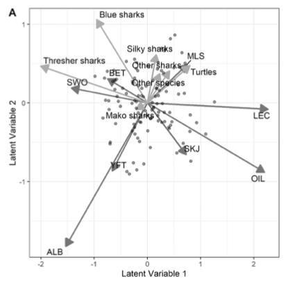

([QUICK LINK TO GET THE DATA](https://github.com/cbrown5/predictive-ecological-models/raw/main/data-cleaned.zip))


```{r setup, include=FALSE}
knitr::opts_chunk$set(echo = TRUE, message = FALSE, warning = FALSE)
```

Who am I? 

[Chris is a Associate Professor ](https://discover.utas.edu.au/C.J.Brown) at the Institute for Marine and Antarctic Studies, University of Tasmania. Chris and his team in the [Seascapemodels](https://www.seascapemodels.org/) lab work on the conservation of ocean ecosystems and sustainable management of fisheries. His team uses advances in statistical modelling approaches to synthesize ecological data and inform environmental decision making. 

Chris' career was built with R's open-source tools. He is paying forwards that favour by [creating free R resources](https://www.seascapemodels.org/code.html) and teaching workshops far and wide. 

# Introduction

R is the leading programming language for ecological modelling for good reason. Being free and open-source certainly helps. Having strengths in dataviz also helps. And because of these traits, R now has a huge ecosystem of user-contributed packages that enable sophisticated modelling applications. 

This ecosystem of R packages is created by a huge community of R users, many of whom are leaders in their field developing cutting edge statistical models and data science tools. This means if you know R, you can access cutting edge tools and combine them in new ways. 

While there are other languages that excel for scientific computing, R owns the market in statistical ecological modelling, the topic of this course. 

Until quite recently most R users would prepare their data outside of R (e.g. in excel or Arc GIS) and then read it into R for the modelling. But R now also has efficient and user friendly GIS and mapping packages. This means you can create your entire analysis workflow, from data download to visualization, in R. 

But starting an project in R can be daunting for new users. There is a steep learning curve for coding, and there are so many options for packages it is easy to get decision paralysis. 

So in this course we are going to provide an introduction to some common modelling approaches in R. We will also learn how to build an efficient workflow. Our goals today are:

1. Overview R's capability for data analysis, plotting and mapping

2. Learn how to build efficient and repeatable workflows for predictive modelling  

3. Learn how to run some models  

4. Learn how to visualize spatial data and model results   

This course is suitable for people who have some R experience. It is not a beginners course, but users with a little bit of R experience can follow through the first few sections. 


## Methods we will cover

In this course we'll overview: 

- Mapping in R with shapefiles and rasters (using the modern packages `sf` and `terra`)

- Generalized linear models 

- Generalized additive models 

## What you'll need 

Make sure you have a recent version of R (available at the CRAN website) and Rstudio installed (free desktop version is fine). 

You will need to install these packages: 

```{r, eval=FALSE}
install.packages(c("tmap", "tidyverse", 
                   "sf", "corrplot",
                   "patchwork", "visreg"))

```

[You will also need to download the data for the course](https://github.com/cbrown5/predictive-ecological-models/raw/main/data-cleaned.zip). 

## Case-study: Bumphead parrotfish, 'Topa' in Solomon Islands

Bumphead parrotfish (*Bolbometopon muricatum*) are an enignmatic tropical fish species. Adults of these species are characterized by a large bump on their forehead that males use to display and fight during breeding. Sex determination for this species is unknown, but it is likely that an individual has the potential to develop into either a male or female at maturity. 

Adults travel in schools and consume algae by biting off chunks of coral and in the process they literally poo out clean sand. Because of their large size, schooling habit and late age at maturity they are susceptible to overfishing, and [many populations are in decline](https://doi.org/10.1007/s00338-019-01801-z). 

Their lifecycle is characterized by migration from lagoonal reef as juveniles (see image below) to reef flat and exposed reef habitats as adults. Early stage juveniles are carnivorous and feed on zooplankton, and then transform into herbivores at a young age. 


Image: Lifecycle of bumphead parrotfish. Image by E. Stump and sourced from [Hamilton et al. 2017](http://dx.doi.org/10.1016/j.biocon.2017.04.024). 

Until the mid 2010s the habitat for settling postlarvae and juveniles was a mystery. However, the pattern of migrating from inshore to offshore over their known lifecycle suggests that the earliest benthic lifestages ('recruits') stages may occur on nearshore reef habitats. 

Nearshore reef habitats are susceptible to degradation from poor water quality, raising concerns that this species may also be in decline because of pollution. But the gap in data from the earliest lifestages hinders further exploration of this issue. 

In this course we'll be analyzing the first survey that revealed the habitat preferences of early juveniles stages of bumphead parrotfish. These data were analyzed by [Hamilton et al. 2017](http://dx.doi.org/10.1016/j.biocon.2017.04.024) and [Brown and Hamilton 2018](http://dx.doi.org/10.1111/cobi.13079). 

In the 2010s Rick Hamilton (The Nature Conservancy) lead a series of surveys in the nearshore reef habitats of Kia province, Solomon Islands. The aim was to look for the recruitment habitat for juvenile bumphead parrotfish. These surveys were motivated by concern from local communities in Kia that topa (the local name for bumpheads) are in decline. 

In the surveys, divers swam standardized transects and searched for juvenile bumphead in nearshore habitats, often along the edge of mangroves. All together they surveyed 49 sites across Kia. 

These surveys were made all the more challenging by the occurrence of crocodiles in mangrove habitat in the region. So these data are incredibly valuable. 

Logging in the Kia region has caused [water quality issues that may impact nearshore coral habitats](http://dx.doi.org/10.1111/cobi.13079). During logging, logs are transported from the land onto barges at 'log ponds'. A log pond is an area of mangroves that is bulldozed to enable transfer of logs to barges. As you can imagine, logponds are very muddy. This damage creates significant sediment runoff which can smother and kill coral habitats. 

Rick and the team surveyed reefs near logponds and in areas that had no logging. They only ever found bumphead recruits hiding in branching coral species. 

In this course we will first ask if the occurrence of bumphead recruits is related to the cover of branching coral species. We will then develop a statistical model to analyse the relationship between pollution from logponds and bumphead recruits, and use this model to predict pollution impacts to bumpheads across the Kia region. 

The data and code for the original analyses are [available at my github site](https://github.com/cbrown5/BenthicLatent). In this course we will use simplified versions of the original data. We're grateful to Rick Hamilton for providing the data for this course. 

## Planning our project 

An important part of R coding is having an organized workflow. Being organized is important in anything more complex than a one-step R program. Organizing your workflow requires forward planning and sticking to some strategies. In this course we'll follow a simple workflow. 

There are multiple benefits of an organized workflow. You code will be more transparent and repeatable, this will benefit both future you and other researchers. It also means you are less likely to make mistakes and the code is easier to debug when you do. Finally, you may want to share the code publicly so other people can repeat your work. 

First, you'll want to identify your research question. If your question is clear then you can stick to what you need to do, and not end up going down rabbit holes creating code you won't use. Once you have that question I recommmend considering fives steps in your workflow: 

### 1. Gather the data 

You will need to source data, often from online data repositories. Even if you have collected species observations yourself, you will likely need to get environmental covariates for prediction from sources such as weather bureaus, oceanographic repositories or climate models. 

### 2. Data wrangling 

The data needs to be read into R and 'wrangled' into the appropriate data structure for the modelling packages you will use. Just a warning, some packages require different data structures, so make sure you know what you want! For a spatial model this step can involve a lot of (complex) GIS. Thankfully, R has good packages for GIS. 

### 3. Dataviz 

Before starting I always use R's powerful data visualisation tools to explore the data. This gives you a deeper understanding of what you'll model, can help avoid conceptual flaws. Also, you may want to save some data plots for your publication. In this course we'll use R markdown to make a report on our data that can be easily shared with collaborators. 

### 4. Modelling  

Finally, we get to the modelling. This is where we'll spend most time in this course 


### 5. Modelviz  

A powerful way to communicate your models is by making more dataviz. In this course we'll use dataviz look at what the models say are important environmental drivers of fish abundance. 

One final note, the above can be an iterative process. But organize your R scripts like the above and it will be much easier. 

## Lets get started 

So that's all the background, let's get started. We'll work through each step of the above workflow. 

# Setting up your project folder 

Start up Rstudio. I recommend setting up each project as an Rstudio project. Click File>New Project and follow the prompts to create a New project directory. Then drop the data folder into this directory (and make sure you unzip it). 

Also create subdirectories for 'images' and 'scripts', this is where we'll save images and R scripts respectively. 

For complex projects you'll want to create other subfolders to keep organized. e.g. I often have a folder for documents and a folder for model outputs. 

Now whenever you want to work on this project double click the .Rproj file. It will open Rstudio in this working directory (so you never need use `setwd` again!). 

With the project open create a new R script (File>New File>R Script) and save it in the scripts folder. We'll now write our R code in this script.

Just double check your are in the top level working directory by typing `getwd()` into the console. If you opened the .RProj file you will be already there. If you are not, navigate there (e.g. with Session>Set Working Directory). 

## Example directory structure for the project

Keeping organized is critical for any complex R project. Here's one example of how I organise my files. 

```
project/
├── data/
│   ├── raw/                # Raw data files
├── data-cleaned/            # Cleaned data files
├── scripts/
│   ├── 1_data_wrangling.R  # Script for data wrangling
│   ├── 2_dataviz.R         # Script for data visualization
│   ├── 3_modelling.R       # Script for modeling
│   └── helpers.R           # Helper functions
├── outputs/
│   ├── figures/            # Generated figures and plots
│   ├── models/             # Saved model objects
│   └── tables/             # Generated tables
├── images/                 # Images used in the project
├── docs/                   # Documentation or reports
│   └── report.Rmd          # R Markdown report
├── README.md               # Project description and instructions
└── project.Rproj           # RStudio project file
```

# 1. Gather the data 

## Where do I get data for models from? 

You should have the data for this course already, if not [download it from github](https://github.com/cbrown5/predictive-ecological-models/raw/main/data-cleaned.zip). 

Data for models can come from many sources. The response variable is of typically species, presence, abundance or biomass. This data may come from your own surveys, those of collaborators, online repositories, government agencies or NGOs. Examples of data sources include fisheries surveys and citizen science programs. 

You'll also want some covariates, which we'll use for predicting the species. These may be included with the data, but are often obtained from other sources. For instance, the ['Australian Ocean Data Network'](https://portal.aodn.org.au/) has a huge amount of different ocean data sources all available to researchers for free. In my state the Queensland government also has repositories of geographic datasets that can be downloaded. Other states and countries have similar services. 

There are specialized R packages for accessing environmental data, such as [rnaturalearth](https://cran.r-project.org/web/packages/rnaturalearth/vignettes/rnaturalearth.html). The [rLandsat](https://github.com/atlanhq/rLandsat) can directly download landsat data from the USGS and help you process it. 

Other common data sources include [UNEP](https://data.unep-wcmc.org/) and [Exclusive Economic Zones](https://www.marineregions.org/downloads.php). 

If you know the data you want, try websearches 'r landsat' or 'r packages landsat' to see if there is a package available to ease the task fo getting the data in an R friendly format. 

If not try search the data type and 'download' or 'shapefile' (for spatial data). 

Another strategy is to look at peer-reviewed papers doing similar analyses and see what data sources they cite.  

For this course I've already provided you with the data, so let's get started on reading that into R. 

## Setup for optimal use of github copilot

Create a readme.md file
Document project aims, R package preferences, suggesetd analyses, data paths and meta-data in your readme.
Use copilot in 'ask' mode if you need help planning. 
Once you have a complete plan you can use copilot in 'agent' mode to run the analysis

## Load in the data

```{r}
library(tidyverse)
dat <- read_csv("data-cleaned/fish-coral-cover-sites.csv")

```

```{r, eval=FALSE}
dat
summary(dat)
```

## Exploring data

I prefer the `ggplot2` package for plotting. It is easy to change how plots look with this package. 

```{r}
ggplot(dat) + 
  aes(x = secchi, y = pres.topa) + 
  geom_point() + 
  stat_smooth()
```

This makes a x-y scatter plot. The ggplot(dat) declares the dataframe from which we’ll draw variables and also creates the page for the plot. The aes stands for aesthetics for the plot, here we use it to declare an x axis which is the variable Abundance of topa (`pres.topa`). Then geom_points declares a geometry object which decides how the aesthetics are plotted to the page. 

We've also added a trend line with `stat_smooth()`. 

Let's do a boxplot too: 

```{r}
ggplot(dat) + 
  aes(x = logged, y = pres.topa) + 
  geom_boxplot()
```

We see that topa are more abundant in unlogged sites.

```{r}
ggplot(dat) + 
  aes(x = secchi, y = CB_cover) + 
  geom_point() + 
  stat_smooth()
```

```{r}
dat <- dat |>
  mutate(CB_cover_percent = 100*CB_cover/n_pts)
```
This code is creating a new column `CB_cover_percent` in the `dat` dataframe. The pipe operator `%>%` is used to pass the `dat` dataframe to the `mutate` function, which adds a new column to the dataframe. The new column is calculated as `100 * CB_cover / n_pts`, which converts the coral cover to a percentage.

```{r}
ggplot(dat) + 
  aes(x = secchi, y = CB_cover_percent) + 
  geom_point() + 
  stat_smooth()

```

```{r}
ggplot(dat) + 
  aes(x = dist_to_logging_km, y = CB_cover_percent) + 
  geom_point() + 
  stat_smooth()
```

## Exploring data with copilot 

See above steps about readme.md file. It is important copilot has this context. 

1. Open copilot in 'code' or 'agent' mode. 
2. Create a blank script that has your data paths in it OR attach your comprehensive readme file
3. Ask copilot to create and save the `head()` of the data. 
4. Start a new script e.g. `1_data_viz.R` 
5. Open 'agent' or 'code' mode. Attach the data head. 
6. Ask copilot to create the plots you want. 

Tips:

Attaching a head of the data helps copilot understand the data structure and types of data. Studies have found this gives the best results for R. 

You can attach all the data, but this can be slow, wastes tokens (so the rest of your conversation will need to be shorter) and also won't work for large datasets. 

Refer to variable names in your prompt will be most effecient. But copilot can probably figure out the variable names from the head of the data if they are sensible. 

Always check for mistakes. 

## Exploring correlations in the data 

```{r eval=FALSE}
icol <- sapply(dat, is.numeric)
pairs(dat[,icol])
round(cor(dat[,icol]),2)
```

Which could also be summarized as a `corrplot`:

```{r}
icol <- sapply(dat, is.numeric)
library(corrplot)
corrplot(cor(dat[,icol]))
```


# 2. Dataviz 

I would make this in a new  script and call it something like `2_dataviz.R`, so the order of scripts is clear. 

```{r}
library(tidyverse)
dat <- read_csv("data-cleaned/fish-coral-cover-sites.csv")
```


As you'll see we've already done a lot of dataviz, but now we'll make finished products for using in a report or publication. 

### Combining multiple plots 

patchwork is a fun way to do this task

```{r}
library(patchwork)
```

First we save each ggplot as an object, that can be printed on demand: 


```{r}
g1 <- ggplot(dat) + 
  aes(x = dist_to_logging_km, y = secchi) + 
  geom_point() + 
  stat_smooth() +
  xlab("Distance to log ponds (km)") +
  ylab("Secchi depth (m)")  +
  theme_classic()
g1
```

This code sets the default theme for all subsequent plots to `theme_classic()`, which is a clean and simple theme.

```{r}
theme_set(theme_classic())
```

```{r}
g2 <- ggplot(dat) + 
  aes(x = dist_to_logging_km, y = CB_cover) + 
  geom_point() +
  stat_smooth() + 
  xlab("Distance to log ponds (m)") +
  ylab("Coral cover (%)")

g3 <- ggplot(dat) + 
  aes(x = CB_cover, y = pres.topa) + 
  geom_point() + 
    stat_smooth() + 
  xlab("Coral cover (%)") +
  ylab("Topa abundance")
    

```

Now use `+`, `/` and `()` to arrange your plots into a patchwork: 

```{r}
gall <- g1 + g2 + g3
gall
``` 

This code arranges the plots in a single row with the specified widths and adds labels to each plot.

```{r}
gall <- g1 + g2 + g3 + 
  plot_layout(nrow = 1, widths = c(1, 0.5, 0.5)) + 
  plot_annotation(tag_levels = "A")
gall
```

Finally, you can save the image: 

```{r eval=FALSE}
ggsave("outputs/plot1.png", gall, width = 8, height = 3)
```

# 3. Spatial data and making maps

## The sf package

The `sf` package is used for handling spatial data in R. It provides a simple and consistent interface for working with spatial data, including reading, writing, and manipulating spatial objects.

We've picked the column `"pres.topa"` for the colour scale. 

```{r}
library(tmap)
library(sf)
```


```{r}
#Read land from a geopackage
land <- st_read("data-cleaned/land.gpkg")
#Read logponds from a geopackage
logponds <- st_read("data-cleaned/logponds.gpkg")
#Read sdat from a geopackage
sdat <- st_read("data-cleaned/spatial-fish-coral-cover-sites.gpkg")
```  

The `sf` package provides a simple and consistent interface for handling spatial data in R. It allows you to read, write, and manipulate spatial objects, making it easier to work with spatial data in your analyses.

## How to use copilot to summarize spatial data

You can ask copilot to make summaries then return those summaries to itself. Use 'agent' mode to do this. Then get it to document what it finds in the `readme.md` file. 

For example: 

"Read land.gpkg and logponds.gpkg, create summaries using head() and st_crs in this file. that you can look at. Then document the file paths and  meta-data in readme.md"


## The tmap package

I like to use `tmap` for maps. 

`tmap` works much like `ggplot2` in that we build and add on layers. In this case we have just one layer, from `sdat2`. We declare the layer with `tm_shape()` (in this case `sdat2`), then the plot type with the following command. 

Here we are using `tm_symbols` to plot dots of the coordinates. Other options are `tm_polygons`, `tm_dots` and many others we'll see later.  

## Load our spatial data 


```{r}
library(tmap)
tm_shape(sdat) + 
  tm_symbols(col = "pres.topa", size = 0.2)
```

We can also save tmap layers, e.g. the layer for land will come in handy later: 

```{r}
tland <- tm_shape(land) + 
  tm_fill()
```

Now we can layer land and the survey sites: 

```{r}
my_map <- tland + 
  tm_shape(sdat) + 
  tm_symbols(col = "pres.topa", size = 0.2) +
  tm_scale_bar(position = c("right", "top"))
  my_map
```  

[Read more about tmap in the package](https://r-tmap.github.io/tmap/). 

Try make a map of one of the other variables like `secchi` or `CB_cover`. 

To change the map colour scale, you can use the `tm_symbols` function with the `palette` argument. For example:

```{r}
tm_shape(sdat) + 
  tm_symbols(col = "secchi", size = 0.2, palette = "Blues")
```

To explore colour palette options:

```{r eval=FALSE}
tmaptools::palette_explorer()
```


```{r}
tmap_save(my_map, filename = "outputs/map-pres-topa.png", width = 8, height = 6)
```

# 4. Predictive modelling  

You might like to start another script here and call it `3_modelling.R`. 

## Choosing a model  

Ecological modelling is a huge research field and there are many options for choosing a model. I classify predictive models into two types: model based approaches and machine learning (algorithm) based approaches. In this course we'll look at model based approaches, but first a brief overview. 

### Machine learning (algorithm) based approaches

These approaches gained popularity in the 00s with algorithms such as boosted regression trees (check out Jane Elith's papers) and maxent. They are very flexible in terms of data they can fit, and can have excellent predictive power. But on the downside they 'black boxes' and it can be hard for humans to interpret why they make good predictions.

### Model based approaches

Model based approaches fit models to data. I prefer to use model-based approaches because they let me interpret the results (e.g. how does a species respond to increasing temperature?). Model approaches also are better at estimating and representing uncertainty bounds than machine learning approaches. Finally, model based approaches let us deal directly with spatial autocorrelation. Dealing with spatial autocorrelation is essential for most spatial ecological datasets. 

Another issue that commonly arises (that I won't deal with here) is imperfect detection of species. Model based approaches can handle this. 

### Hybrid approaches 

There's always a grey area to any dichotomy. More recent predictive model developments are utilizing neural network (machine learning) to fit complex multispecies and process-based models. 

Check out the R package [`mistnet`](https://rdrr.io/github/davharris/mistnet2/man/mistnet.html) for one example. Another interesting development is Joseph's ['neural hierarchical models'](https://mbjoseph.github.io/posts/2020-01-13-neural-hierarchical-models/) (implemented in the python language) which apply machine learning to train process models of multi-species communities. 

### Comparison of some different predictive model options 

```{r echo = FALSE}
datmodels <- read_csv("model-types.csv")
knitr::kable(datmodels)
```

*Note that point process models are [mathematically equivalent to maxent](https://onlinelibrary.wiley.com/doi/abs/10.1111/j.1541-0420.2012.01824.x) and can be implemented with many packages, e.g. [INLA pkg's SPDE approach](https://becarioprecario.bitbucket.io/spde-gitbook/ch-lcox.html)

### Some examples 

[In a study](https://onlinelibrary.wiley.com/doi/abs/10.1111/gcb.15472) I wanted to know how fish catch related to fish abundance and environmental variables, notably temperature. This was a spatial and temporal model of fish catch. I developed a Bayesian hierarchical model with the [`brms` pkg](https://cran.r-project.org/web/packages/brms/index.html). brms let me develop a bespoke model of catch as it related to inwater fish biomass and heatwaves. 

Importantly, I could also model for uncertainty in the predictor variable of fish biomass (something non-Bayesian models have a hard time doing). The results suggested that coral trout were easier to catch during a heatwave. 

Tuna longline fisheries can have high bycatch of threatened species, like turtles and sharks. Understanding how bycatch relates to environmental variables, but also target fish species can help us design more effective regulations for avoiding bycatch. [We used multispecies distribution models ](https://doi.org/10.1016/j.marpol.2021.104664) (AKA joint models) to study catch of target tuna and bycatch in several longline fisheries. Models were implemented [with boral pkg in R](https://cran.r-project.org/web/packages/boral/boral.pdf). 

The results revealed clusters of bycatch that were associated with certain fishing practices and targeting of certain tuna species (notably yellowfin over bigeye). 


Image: Ordination of catch and bycatch in the longline sets from Palau longline tuna fishery. The ordination was made from a joint model 'boral' ([Brown et al. 2021](https://doi.org/10.1016/j.marpol.2021.104664))

Finally, [for our analysis of bumphead parrotfish](http://dx.doi.org/10.1016/j.biocon.2017.04.024) I used path analysis. This can be done with the [piecewiseSEM](https://cran.r-project.org/web/packages/piecewiseSEM/index.html) package. Path analysis is great for inference on causes of change (but not so powerful for prediction in my experience). The path analysis suggested that bumphead were in decline both from loss of habitat, but also direct effects of water quality on the fish themselves. 

### How to decide what model to use? 

Here are some good questions to ask

- Am I most interested in inference?  
If yes avoid machine learning approaches 

- Am I most interested in making the most accurate predictions, especially to new locations?
If yes, machine learning approaches are often better.

- Is it important to represent uncertainty in outputs? 
If yes avoid machine learning approaches and preference Bayesian approaches

- Is spatial AC a problem? 
Answer is almost certainty yes, see table above for options. 

- Are there non-linear relationships? (probably yes)
Answer is almost certainty yes, use more flexible approaches like machine learning or GAMs (and Bayesian approaches). 

- Do I want to implement bespoke model formulas?  
If yes, use Bayesian approaches 

- How long can I wait for a model computations ? 
If its <1 minute then avoid Bayesian approaches (or use INLA, which is very fast)

- What is my technical capability? 
If your just starting out use GLMs or GAMs. If you want to go Bayesian, an easy start is brms or hmsc for multispecies models 

## Preparation of covariates 

So now we've covered some modelling options, let's do some modelling. 

We are going to start with simpler models and work our way through. In a real workflow you might do things differently. For a complex analysis its good to start simple. Whereas for a straightforward GLM you might start with the most complex model including all covariates and work your way backwards to simplifying it. 

First up we'll make percent cover variables 

```{r}
sdat <- sdat |>
  mutate(CB_cover_percent = 100*CB_cover/n_pts,
         soft_cover_percent = 100*soft_cover/n_pts)
```
'

# 5. Generalized linear models

[If you need to quickly learn the basics of GLMs start here](https://www.seascapemodels.org/rstats/2018/01/19/intro-to-glms.html) then [read this article on link functions](https://www.seascapemodels.org/rstats/2018/10/16/understanding-the-glm-link.html)

## Introduction to GLM families

Generalized Linear Models (GLMs) are a flexible generalization of ordinary linear regression that allows for response variables that have error distribution models other than a normal distribution. The different families of GLMs include:

- Gaussian: Used for continuous response variables with a normal distribution.
- Poisson: Used for count data with a Poisson distribution.
- Negative Binomial: Used for overdispersed count data.
- Binomial: Used for binary response variables.

```{r echo=FALSE}
# Histograms for different distributions
set.seed(123)

# Gaussian distribution
gaussian_data <- rnorm(1000, mean = 2, sd = 2)
g_gaussian <- ggplot(data.frame(x = gaussian_data), aes(x = x)) +
  geom_vline(xintercept = 0, linetype = "dashed") +
  geom_histogram(binwidth = 0.2, fill = "blue", alpha = 0.7, color = "black") +
  ggtitle("Gaussian Distribution") +
  xlab("Value") +
  ylab("Frequency") +
  theme_classic() + 
  xlim(-3, 15)

# Poisson distribution
poisson_data <- rpois(1000, lambda = 2)
g_poisson <- ggplot(data.frame(x = poisson_data), aes(x = x)) +
geom_vline(xintercept = 0, linetype = "dashed") +
  geom_histogram(binwidth = 1, fill = "green", alpha = 0.7, color = "black") +
  ggtitle("Poisson Distribution") +
  xlab("Value") +
  ylab("Frequency") +
  theme_classic()+ 
  xlim(-3, 15)

# Negative Binomial distribution
neg_binom_data <- rnbinom(1000, size = 2, mu = 2)
g_neg_binom <- ggplot(data.frame(x = neg_binom_data), aes(x = x)) +
geom_vline(xintercept = 0, linetype = "dashed") +
  geom_histogram(binwidth = 1, fill = "red", alpha = 0.7, color = "black") +
  ggtitle("Negative Binomial Distribution") +
  xlab("Value") +
  ylab("Frequency") +
  theme_classic()+ 
  xlim(-3, 15)

# Combine the plots using patchwork
(g_gaussian | g_poisson | g_neg_binom) +
  plot_annotation(tag_levels = "A")

```
## Choosing a model with copilot  

Copilot can give valid statistical advice, but it can also give bad advice. Here are some tips on prompting:   


Poor prompt: "What test can I use to test the relationship between pres.topa and CB_cover_percent?"

What this prompt does right is tell copilot the variable names. However, it will likely make several suggestions for tests, some of which will be better than others. 

A better outcome would be to attach the head() of the data to the question. Then it has some context about the data. You should also give more context:

Better: "What test can I use to test the relationship between pres.topa and CB_cover_percent? pres.topa is counts of fish abundance at 50 different sites. At each site a survey with standard area was conducted. CB_cover_percent is the cover of branching coral at those sites, also from surveys with standardized area."

Another approach is to ask the short question, but also attach you readme.md (if you have put all this contextual information in the readme). 

The absoluate best would be to prompt it to provide advice on model verification. If you know what these tests are already, then say that. If you do not know, you could ask:

Better: "What test can I use to test the relationship between pres.topa and CB_cover_percent? pres.topa is counts of fish abundance at 50 different sites. At each site a survey with standard area was conducted. CB_cover_percent is the cover of branching coral at those sites, also from surveys with standardized area.
Make sure your answers follow statistical best practice. Be sure to include appropriate model verification tests. 
"

You could then follow-up with: 

"Take a deep breath and think about your response above. Then evaluate the quality of this advice"

Or 

"I'm really paranoid about finding significant results that are not real. You'll get fired if this turns out to be bad advice. Are you sure this is most robust way to do this analysis?"


## Modelling Topa counts with a gaussian GLM

Let's explore how different families behave when we use them to fit a GLM. We'll model topa counts. 
Our statistical question will be to ask whether Topa abundance is affected by branching coral (CB_cover_percent) and/or soft coral (soft_cover_percent). We'd like to know what habitats are important for Topa. '

What distribution family would you pick for this data?

```{r}
m1 <- glm(pres.topa ~ CB_cover_percent + soft_cover_percent, 
           data = sdat, family = "gaussian")
```

This model attempts to predict the response variable (pres.topa) based on the linear combination of the predictors (CB_cover_percent and soft_cover_percent).
It estimates the coefficients (slopes) for each predictor to determine how changes in coral cover percentages affect the presence or abundance of Topa.

Assumptions: 
- The response variable (pres.topa) is continuous and follows a normal distribution.
- The relationship between the predictors and the response is linear.
- Homoscedasticity (constant variance of residuals) and independence of observations.

Potential Issues: If pres.topa is not continuous or normally distributed (e.g., if it represents counts or proportions), the "gaussian" family may not be appropriate. In such cases, other families like "poisson" (for counts) or "binomial" (for binary outcomes) might be better suited.

We can check how the model does by plotting some diagnostic plots. 

```{r}
par(mfrow = c(2,2))
plot(m1)
```

(The par() command just puts the plots on a 2x2 panel)

Note how the QQ plot shows a long upwards tick at high values. This means the model is underprediting high values. 
Also note that the residuals vs fitted are not 'homoscedastic' - The spread of data points increases for higher predicted values. 

This is characteristic of counts. For sites with low mean abundance the variance is low (because values are near zero). For sites with high mean abundance the variance is high (because values are more spread out).

For the gaussian there is also an additional logical inconsistency - it can predict negative counts. Let's look at what the model would predict for topa abundance across different coral cover values. (we'll see how to make these plots later on)

```{r echo=FALSE}
# Create a new data frame with a sequence of CB_cover_percent values
# and the mean value of soft_cover_percent
new_data <- data.frame(
  CB_cover_percent = seq(0, 100, by = 1),
  soft_cover_percent = mean(sdat$soft_cover_percent, na.rm = TRUE)
)

# Generate predictions from the model
predictions <- predict(m1, newdata = new_data, se.fit = TRUE)

# Add predictions and confidence intervals to the new data
new_data$predicted <- predictions$fit
new_data$se <- predictions$se.fit
new_data$lower_ci <- new_data$predicted - new_data$se
new_data$upper_ci <- new_data$predicted + new_data$se

# Add observed data points to see how well the model fits
ggplot(new_data, aes(x = CB_cover_percent, y = predicted)) +
  geom_ribbon(aes(ymin = lower_ci, ymax = upper_ci), alpha = 0.2) +
  geom_line() +
  geom_point(data = sdat, aes(x = CB_cover_percent, y = pres.topa), 
             alpha = 0.5, color = "blue") +
  labs(
    x = "Branching Coral Cover (%)",
    y = "Topa Abundance",
    title = "Predicted vs. Observed Topa Abundance by Branching Coral Cover"
  ) +
  theme_classic()

```

Notice how the SEs (grey shading) are going into negative values. 

## Modelling Topa counts with a poisson GLM

```{r}
m2 <- glm(pres.topa ~ CB_cover_percent + soft_cover_percent, 
           data = sdat, family = "poisson")
```

```{r}
par(mfrow = c(2,2))
plot(m2)
```

This seems to be doing better, but there are still some extreme values. 

Let's see its predictions:

```{r echo=FALSE}
# Create a new data frame with a sequence of CB_cover_percent values
# and the mean value of soft_cover_percent
new_data <- data.frame(
  CB_cover_percent = seq(0, 100, by = 1),
  soft_cover_percent = mean(sdat$soft_cover_percent, na.rm = TRUE)
)
# Generate predictions from the model
predictions <- predict(m2, newdata = new_data, type = "response", se.fit = TRUE)
# Add predictions and confidence intervals to the new data
new_data$predicted <- predictions$fit
new_data$se <- predictions$se.fit
new_data$lower_ci <- new_data$predicted -  new_data$se
new_data$upper_ci <- new_data$predicted + new_data$se
# Add observed data points to see how well the model fits
gpois <- ggplot(new_data, aes(x = CB_cover_percent, y = predicted)) +
  geom_ribbon(aes(ymin = lower_ci, ymax = upper_ci), alpha = 0.2) +
  geom_line() +
  geom_point(data = sdat, aes(x = CB_cover_percent, y = pres.topa), 
             alpha = 0.5, color = "blue") +
  labs(
    x = "Branching Coral Cover (%)",
    y = "Topa Abundance",
    title = "Poisson"
  ) 
  gpois
```

Note how the predictions curve up. This is because the poisson uses a log link to model the data on the log scale. So our predictors are now multiplicative. This often makes sense for count data. 

We'll discuss the link function in class, [there is also a gentle introduction here](https://www.seascapemodels.org/rstats/2018/10/16/understanding-the-glm-link.html). 

The poisson still isn't capturing the full variabilit in our data though. Let's try the negative binomial. 

## Modelling Topa counts with a negative binomial GLM

```{r}
library(MASS)
m3 <- glm.nb(pres.topa ~ CB_cover_percent + soft_cover_percent, 
              data = sdat)
```

```{r}
par(mfrow = c(2,2))
plot(m3)
```

Doing better, still not perfect. However, you never expect real data to be perfect. 

```{r echo=FALSE}
# Create a new data frame with a sequence of CB_cover_percent values
# and the mean value of soft_cover_percent
new_data <- data.frame(
  CB_cover_percent = seq(0, 75, by = 1),
  soft_cover_percent = mean(sdat$soft_cover_percent, na.rm = TRUE)
)
# Generate predictions from the model
predictions <- predict(m3, newdata = new_data, type = "response", se.fit = TRUE)
# Add predictions and confidence intervals to the new data
new_data$predicted <- predictions$fit
new_data$se <- predictions$se.fit
new_data$lower_ci <- new_data$predicted -  new_data$se
new_data$upper_ci <- new_data$predicted + new_data$se
# Add observed data points to see how well the model fits
gnb <- ggplot(new_data, aes(x = CB_cover_percent, y = predicted)) +
  geom_ribbon(aes(ymin = lower_ci, ymax = upper_ci), alpha = 0.2) +
  geom_line() +
  geom_point(data = sdat, aes(x = CB_cover_percent, y = pres.topa), 
             alpha = 0.5, color = "blue") +
  labs(
    x = "Branching Coral Cover (%)",
    y = "Topa Abundance",
    title = "Negative binomial"
  ) +
  theme_classic()

  gpois + gnb
```

The NB uses a log link ,so again we get the upwards cureve. Notice how it has much broader SEs, which represent the extra variability in the data and thus uncertainty in the mean effect of CB. 

## Choosing the best model 

The gaussian is clearly inappropriate. How do we chose between the poisson and negative binomial?

```{r}
summary(m2)
summary(m3)
```

For the poisson we can compare the residual deviance vs. residual degrees of freedom to see that the data is overdispersed for a poisson (we want the ratio to be close to 1)

Low `theta` values also indicate overdispersion. Low theta means the NB is modelling a lot of dispersion. 

We can also use the `AIC` to compare models.

```{r}
AIC(m2, m3)
```

The model with the lowest AIC is the best. 

[More detail on the theory here.](https://www.seascapemodels.org/rstats/2018/04/13/how-to-use-the-AIC.html)

# Interlude: copilot agents 

Github copilot are increasing adding tools. These tools let the chat model do things. One such tool is a websearch tool. This lets the model search the web for information.

You need to install the 'websearch for copilot' in VS code, then get an API key with Tavily (free) or Bing (paid). Then once enabled copilot can help with websearches. Though TBH its often faster to do the websearch yourself. 

For example:

"use websearch to find some packages for modelling zero inflated count data" 

Then you could keep iterating prompts to get it to find specific advice on code or statistics. 

# 6. Comparing predictive power of habitat variables

Let's proceeed with the NB. 

Our next question is what habitat variables matter. 

There are a few ways to do this. 

- Compare models with AIC
- Use a likelihood ratio test
- Compare coefficients

```{r}
summary(m3)
```

CB is significant, but soft coral is not.

```{r}
m4 <- glm.nb(pres.topa ~ CB_cover_percent, 
              data = sdat)
```

We could also compare AIC values:

```{r}
AIC(m3, m4)
```

So excluding soft coral is a more parimonious model.

```{r}
anova(m3, m4, test = "Chisq")
```

This is a likelihood ratio test. The p-value is large (>0.05), so we can accept the null hypothesis that the two models explain an equivalent amount of variance. '

## AIC for branching coral cover

```{r}
m5 <- glm.nb(pres.topa ~ 1, data = sdat)
AIC(m4, m5)
```

So just confirming we are better off having branching coral cover in the model. So `m4` is our 'best' model. 

## Comparing models for predictive power

If we are really emphasising predictive power over inference, we can use cross-validation to compare models. This is the best way to evaluate predictive power. I won't show the code as its a bit complex but in brief what we do is: '

1. Split the data into training and test sets
2. Fit the model to the training set
3. Predict the response variable for the test set
4. Calculate the prediction error (e.g., RMSE or MAE) for the test set
5. Repeat the process for each observation in the dataset (leave-one-out cross-validation)

The MAE is defined as absolute values of the difference between the predicted and observed values. Lower values mean the predictions are closer to the observed values. Let's take a look at this for our two models: 

```{r echo=FALSE}
# Implementing leave-one-out cross-validation (LOOCV)
n <- nrow(sdat)
predictions_m3 <- numeric(n)
predictions_m4 <- numeric(n)
observed <- sdat$pres.topa

# LOOCV loop
for(i in 1:n) {
  # Create training sets by leaving out one observation
  train_data <- sdat[-i, ]
  test_data <- sdat[i, ]
  
  # Fit models on training data
  m3_cv <- try(glm.nb(pres.topa ~ CB_cover_percent + soft_cover_percent, data = train_data), silent = TRUE)
  m4_cv <- try(glm.nb(pres.topa ~ CB_cover_percent, data = train_data), silent = TRUE)
  
  # Make predictions on the left-out observation
  if(!inherits(m3_cv, "try-error")) {
    predictions_m3[i] <- predict(m3_cv, newdata = test_data, type = "response")
  } else {
    predictions_m3[i] <- NA
  }
  
  if(!inherits(m4_cv, "try-error")) {
    predictions_m4[i] <- predict(m4_cv, newdata = test_data, type = "response")
  } else {
    predictions_m4[i] <- NA
  }
}

# Calculate prediction errors
m3_rmse <- sqrt(mean((predictions_m3 - observed)^2, na.rm = TRUE))
m4_rmse <- sqrt(mean((predictions_m4 - observed)^2, na.rm = TRUE))

# Calculate mean absolute error
m3_mae <- mean(abs(predictions_m3 - observed), na.rm = TRUE)
m4_mae <- mean(abs(predictions_m4 - observed), na.rm = TRUE)

# Print results
cat("Model 3 (with soft coral) MAE:", m3_mae, "\n")
cat("Model 4 (without soft coral) MAE:", m4_mae, "\n")

# Visualize predictions vs observed
cv_results <- data.frame(
  Observation = 1:n,
  Observed = observed,
  Model3_pred = predictions_m3,
  Model4_pred = predictions_m4
)

# Plot observed vs predicted
ggplot(cv_results, aes(x = Observed)) +
  geom_point(aes(y = Model3_pred, color = "Model with soft coral"), alpha = 0.7) +
  geom_point(aes(y = Model4_pred, color = "Model without soft coral"), alpha = 0.7) +
  geom_abline(intercept = 0, slope = 1, linetype = "dashed") +
  labs(
    x = "Observed Topa Abundance",
    y = "Predicted Topa Abundance",
    title = "LOOCV: Observed vs Predicted Values",
    color = "Model"
  ) +
  theme_classic()
```

So including soft coral increases the error. Why is this? 

## A note on model selection
'
In this case all our model selection approaches tell us to use `m4`, the model without soft coral. But what if they disagreed? 

We'll discuss different model selection philosophies in class. '

# 7. Making predictions across space 

## Predictive plot with visreg 

So we have decided on our best model. Its one with branching coral cover and not soft coral. We use the NB distribution. Let's look at predicted effects of branching coral cover on topa abundance.

We'll use the visreg package to do this. 

```{r}
par(mfrow = c(1,1))
library(visreg)
visreg(m4)
```

This shows 95% confidence intervals for the values on **on the log scale**. We'll discuss how to interpret this in class. '

Here is the same model but with predictions on the response scale (ie number of topa per survey): 

```{r}
par(mfrow = c(1,1))
visreg(m4, "CB_cover_percent", 
       gg = TRUE, 
       scale = "response",
       xlab = "Branching coral cover (%)",
       ylab = "Topa abundance",
       main = "Predicted Topa abundance by branching coral cover")
```

## Map of predictions 

Once we have our best model it is straightforward to make its predictions to our sites. These predictions show us the expected mean abundance at a given site. 

```{r}
sdat$predicted <- predict(m4, newdata = sdat, type = "response")
```

Then we can just plot those on a map like before:

```{r}
tm_glm <- tm_shape(land) + 
  tm_fill() +
  tm_shape(sdat) + 
  tm_symbols(col = "predicted", size = 0.2) +
  tm_scale_bar(position = c("right", "top"))
tm_glm 
``` 

## Predicting everywhere in the region (interpolation)

If we wanted we could also use the model to predict to everywhere in the region, so we could make a map something like this:


I won't cover the code here, as it gets complex, however, here is an [example for this dataset in another one of my courses](https://www.seascapemodels.org/SDM-fish-course-notes/2021-09-20-SDM-fish-course.html#Spatial_predictions)

To do that we'd need to know our covariate (CB cover) at all locations. But we haven't surveyed that everywhere. 

So to make this predictive map above I instead used distance to log ponds, which is a covariate that is available everywhere and is also related to topa abundance. Then I put distance to log ponds on a grid. Then i used the same predict function to predict to that grid. Finally we can make the map you see above. 

# 8. Generalized additive models for non-linear relationships 

As a final exercise we'll look at another modelling tool 'GAMs'

My personal favourite. So flexible, so fast, very convenient. 

You can't go past [Generalized Additive Models
An Introduction with R, Second Edition](https://www.routledge.com/Generalized-Additive-Models-An-Introduction-with-R-Second-Edition/Wood/p/book/9781498728331) if you need to learn about these models. 

They are really useful in ecology because they allow for flexible non-linear fits to the data. 

```{r}
library(mgcv)
m1_gam <- gam(pres.topa ~ s(CB_cover_percent),
              family = "nb",
              data = sdat)
```

Looks similar to our GLM, however we add the `s()` function to say we want to fit a non-linear model. 

We need to do the same steps as before, so diagnostic plots. We could also do teh same verification steps as we did before. 

```{r}
par(mfrow = c(2,2))
gam.check(m1_gam)
```

One nice feature of the AIC is we can compare any two models **so long as we have the same response data**. So we can compare different models, models with different families and models with different covariates. These rules don't apply to LR tests. 

```{r}
AIC(m1_gam, m4)
```

So the GAM is preferred over the GLM, suggesting some non-linearrity. 

```{r}
summary(m1_gam)
```

The `edf` value is the effective degrees of freedom. This is a measure of how flexible the model is. Values >1 also indicate non-linearity. 


(`gam.check(m1_gam)` is a good idea to check resids too). 

## Predictions with the GAM

We can do the same predictive steps as before with our GAM to compare it to the GLM.

```{r}
g1_gam <- visreg(m1_gam, "CB_cover_percent", 
       gg = TRUE, 
       scale = "response",
       xlab = "Branching coral cover (%)",
       ylab = "Topa abundance",
       main = "Predicted Topa abundance by branching coral cover")

g1_glm <- visreg(m4, "CB_cover_percent", 
       gg = TRUE, 
       scale = "response",
       xlab = "Branching coral cover (%)",
       ylab = "Topa abundance",
       main = "Predicted Topa abundance by branching coral cover")

(g1_gam + g1_glm) & ylim(0, 50)
```

We can also predict across space like before:

```{r}
sdat$predicted_gam <- predict(m1_gam, newdata = sdat, type = "response")
tm_gam <- tm_shape(land) + 
  tm_fill() +
  tm_shape(sdat) + 
  tm_symbols(col = "predicted_gam", size = 0.2) +
  tm_scale_bar(position = c("right", "top"))

  tm_both <- tmap_arrange(tm_glm, tm_gam, ncol = 2)
  tm_both
```

Note difference in colour scales. The GAM is predicting lower abundances at high coral cover, because of its non-linear fit. 

# 9. Wrap-up and getting help 


So we've discovered how logging is impacting bumphead parrotfish. If we wanted to polish this analysis further, we could intersect our maps of predicted abundance with maps of reefs (see files included in the data folder) and [estimate how much reef habitat is affected by logging](http://dx.doi.org/10.1111/cobi.13079). 

We could also repeat the modelling, but using coral cover, to make inferences about the importance of that for topa recruits. See also bonus section below about confounding. '

## Getting help

> Writing code is 80% googling the answer (unattributed)

If you are going to be a succesful **R** user, then you need to get good at finding help to deal with bugs. The above aphorism is widely subscribed to by professional programmers. **R** is no exception. If you web search an issue, like 'ggplot remove legend' you will commonly get a pretty decent answer on [Stack Overflow](https://stackoverflow.com/questions/35618260/remove-legend-ggplot-2-2) or a similar site. I probably used google tens of times to write these course notes (I can never remember how to put the degrees symbols on plots for instance). 


If the answer doesn't already exist there then sign up to Stack Overflow and ask it yourself (but spend a bit of time looking, no one wants to get tagged for duplicating an existing question!). 

I'll update this aphorism: 

> Writing code is 90% knowing what to ask github copilot

However, always be careful with AI as we've discussed. It has amazing performance (better than humans) on unsolved maths problems. But evaluations are finding even the latest models are mediocore for statistics. Its also not optimized for the R program, so there is still a lot it can't help you with (or will give you faulty answers). 

I'm currently working on guidelines for ecolgoical modelling with genAI including chatGPT and github copilot. So stay tuned on my webage (https://www.seascapemodels.org/) for more infor on that. 

Another good idea is to find a local support group. [R coding is an emotional experience](http://www.seascapemodels.org/rstats/2017/09/18/emotions-of-programming-rstats.html), frustration is a common one, but the elation of finding a solution can help us persist. Having other people to help, or even just listen to your frustrations is a huge help for your motivation to keep learning R.  

BUT don't constrain yourself to web searches. Often the best way to find a method or data is to read the literature and see what other people have used. 

## R books and web material 

There are plenty of good books out there (too many to choose from in fact). For the content we covered today, some good resources are: 

- [R for Data Science](https://r4ds.had.co.nz/), for data wrangling mainly 

- [R Graphics Cookbook](http://www.cookbook-r.com/Graphs/), for ggplot and free on the web

- [Geocomputation in R](https://geocompr.robinlovelace.net/), free on the web

- If you want to learn new tricks, or stay up-to-date with the latest packages, the blog aggregator [R-Bloggers](https://www.r-bloggers.com/) has a non-step feed of R blogs from all over the world and all disciplines, including [Chris' blog](http://www.seascapemodels.org/bluecology_blog.html)

If you prefer to have a printed guide, another tactic is to web search your favourite package and 'cheatsheet'. 

## Resources for species distribution modelling 

- Chris often refers to [Mixed Effects Models and Extensions in Ecology with R](https://www.springer.com/gp/book/9780387874579). Great examples to help you get started in modelling too

- The classic text for GAMs is [Generalized Additive Models: An Introduction with R](https://www.routledge.com/Generalized-Additive-Models-An-Introduction-with-R-Second-Edition/Wood/p/book/9781498728331). This has a very technical treatment of GAMs, but also an extensive section with practical examples, including spatial ones. 

- Here's an [intro to some machine learning models](https://rspatial.org/raster/sdm/index.html)

- Site for [Multispecies distribution modelling with HMSC](https://www2.helsinki.fi/en/researchgroups/statistical-ecology/hmsc). 


# 10. Bonus material 

This is the second time I've taught this course. I also did an earlier one on species distribution modelling that has more information about theory and some other modelling considerations like spatial autocorrelation and interpolation. [So if you want to go deeper check that out](https://www.seascapemodels.org/SDM-fish-course-notes/)

## Cross validation 

Here's the code for the cross validation, in case you are interested.


```{r eval=FALSE}
# Implementing leave-one-out cross-validation (LOOCV)
n <- nrow(sdat)
predictions_m3 <- numeric(n)
predictions_m4 <- numeric(n)
observed <- sdat$pres.topa

# LOOCV loop
for(i in 1:n) {
  # Create training sets by leaving out one observation
  train_data <- sdat[-i, ]
  test_data <- sdat[i, ]
  
  # Fit models on training data
  m3_cv <- try(glm.nb(pres.topa ~ CB_cover_percent + soft_cover_percent, data = train_data), silent = TRUE)
  m4_cv <- try(glm.nb(pres.topa ~ CB_cover_percent, data = train_data), silent = TRUE)
  
  # Make predictions on the left-out observation
  if(!inherits(m3_cv, "try-error")) {
    predictions_m3[i] <- predict(m3_cv, newdata = test_data, type = "response")
  } else {
    predictions_m3[i] <- NA
  }
  
  if(!inherits(m4_cv, "try-error")) {
    predictions_m4[i] <- predict(m4_cv, newdata = test_data, type = "response")
  } else {
    predictions_m4[i] <- NA
  }
}

# Calculate prediction errors
m3_rmse <- sqrt(mean((predictions_m3 - observed)^2, na.rm = TRUE))
m4_rmse <- sqrt(mean((predictions_m4 - observed)^2, na.rm = TRUE))

# Calculate mean absolute error
m3_mae <- mean(abs(predictions_m3 - observed), na.rm = TRUE)
m4_mae <- mean(abs(predictions_m4 - observed), na.rm = TRUE)

# Print results
cat("Model 3 (with soft coral) MAE:", m3_mae, "\n")
cat("Model 4 (without soft coral) MAE:", m4_mae, "\n")

# Visualize predictions vs observed
cv_results <- data.frame(
  Observation = 1:n,
  Observed = observed,
  Model3_pred = predictions_m3,
  Model4_pred = predictions_m4
)

# Plot observed vs predicted
ggplot(cv_results, aes(x = Observed)) +
  geom_point(aes(y = Model3_pred, color = "Model with soft coral"), alpha = 0.7) +
  geom_point(aes(y = Model4_pred, color = "Model without soft coral"), alpha = 0.7) +
  geom_abline(intercept = 0, slope = 1, linetype = "dashed") +
  labs(
    x = "Observed Topa Abundance",
    y = "Predicted Topa Abundance",
    title = "LOOCV: Observed vs Predicted Values",
    color = "Model"
  ) +
  theme_classic()
```